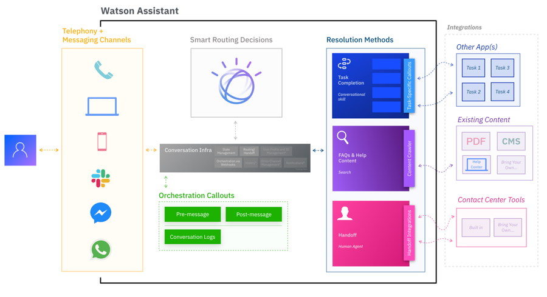

---

copyright:
  years: 2015, 2022
lastupdated: "2022-01-19"

keywords: chatbot, live chatbot, omnichannel

subcollection: watson-assistant

---

{:shortdesc: .shortdesc}
{:new_window: target="_blank"}
{:external: target="_blank" .external}
{:deprecated: .deprecated}
{:important: .important}
{:note: .note}
{:tip: .tip}
{:pre: .pre}
{:codeblock: .codeblock}
{:screen: .screen}
{:javascript: .ph data-hd-programlang='javascript'}
{:java: .ph data-hd-programlang='java'}
{:python: .ph data-hd-programlang='python'}
{:swift: .ph data-hd-programlang='swift'}

{{site.data.content.classiclink}}

# About {{site.data.keyword.conversationshort}}
{: #about}

Use {{site.data.keyword.conversationfull}} to build your own branded live chatbot into any device, application, or channel. Your chatbot, which is also known as an *assistant*, connects to the customer engagement resources you already use to deliver an engaging, unified problem-solving experience to your customers.
{: shortdesc}

| | |
|------------|-------------|
| *Create AI-driven conversational flows* | Your assistant uses industry-leading AI capabilities to understand questions that your customers ask in natural language. It uses machine learning models that are custom-built from your data to deliver accurate answers in real time. |
| *Embed existing help content* | You already know the answers to customer questions? Put your subject matter expertise to work. Add a search integration with {{site.data.keyword.discoveryfull}} to give your assistant access to corporate data collections that it can mine for answers. |
| *Connect to your customer service teams* | If customers need more help or want to discuss a topic that requires a personal touch, connect them to human agents from your existing service desk provider. |
| *Bring the assistant to your customers, where they are* | Configure one or more built-in integrations to quickly publish your assistant on popular social media platforms such as Slack, Facebook Messenger, Intercom, or WhatsApp. Turn the assistant into a member of your customer support call center team, where it can answer the phone and address simple requests so its human teammates can focus on more nuanced customer needs. Make your assistant the go-to help resource for customers by adding it as a chat widget to your company website. If none of the built-in integrations fit your needs, use the APIs to build your own custom app. |
| *Track customer engagement and satisfaction* | Use built-in metrics to analyze logs from conversations between customers and your assistant to gauge how well it's doing and identify areas for improvement. |

## How it works
{: #about-how-it-works}

This diagram illustrates how {{site.data.keyword.conversationfull}} delivers an exceptional, omnichannel customer experience:

Customers interact with the assistant through one or more of these channels:

- A web chat that you embed in your company website and that can transfer complex requests to a customer support representative.
- An existing social media messaging platform, such as Slack, Facebook Messenger, or WhatsApp
- A phone call or text message
- A custom application that you develop, such as a mobile app or a robot with a voice interface

The **assistant** receives a message from a customer and sends it down the appropriate resolution path. 

If you want to preprocess incoming messages, this is where you would use webhooks to inject logic that calls an external service that can process the messages before the assistant routes them. Likewise, you can process responses from the assistant before they are returned to the customer.

The assistant chooses the appropriate resolution from among these options:

- An **action** interprets the customer's message further, then directs the flow of the conversation. The action gathers any information it needs to respond or perform a transaction on the customer's behalf.

- A **search integration** leverages existing FAQ or other curated content that you own to find relevant answers to customer questions.

- If a customer wants more personalized help or wants to discuss a sensitive subject, the assistant can connect the customer with someone from your support team through the web chat integration.

For more information about the architecture, read the [How to Make Chatbot Orchestration Easier](https://medium.com/ibm-watson/how-to-make-chatbot-orchestration-easier-c8ed61620b8d){: external} blog on Medium.com.

To see how {{site.data.keyword.conversationshort}} is helping enterprises cut costs and improve customer satisfaction today, read the [Independent study finds IBM Watson Assistant customers can accrue $23.9 million in benefits](https://www.ibm.com/blogs/watson/2020/03/independent-study-finds-ibm-watson-assistant-customers-accrued-23-9-million-in-benefits/){: external} blog on ibm.com.

This documentation describes managed instances of {{site.data.keyword.conversationshort}} that are offered in IBM Cloud or in Cloud Pak for Data as a Service. If you are interested in on-premises or installed deployments, see [this documentation](/docs/assistant-data?topic=assistant-data-index).
{: note}

Read more about these implementation steps by following these links:

- [Creating an assistant](/docs/watsonassistant?topic=watson-assistant-assistant-add)
- [Building your assistant](/docs/watson-assistant?topic=watson-assistant-build-actions-overview)
- [Publishing and deploying your assistant](/docs/watson-assistant?topic=watson-assistant-publish-overview)

## Browser support
{: #about-browser-support}

The {{site.data.keyword.conversationshort}} application requires the same level of browser software as is required by {{site.data.keyword.Bluemix_notm}}. For more information, see {{site.data.keyword.Bluemix_notm}} [Prerequisites](/docs/overview?topic=overview-prereqs-platform#browsers-platform){: external}. 

For information about the web browsers that are supported by the web chat integration, see [Browser support](/docs/watson-assistant?topic=watson-assistant-deploy-web-chat#deploy-web-chat-browsers).

## Language support
{: #about-lang-support}

Language support by feature is detailed in [Supported languages](https://cloud.ibm.com/docs/watson-assistant?topic=watson-assistant-admin-language-support#admin-language-support-codes).
