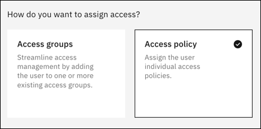
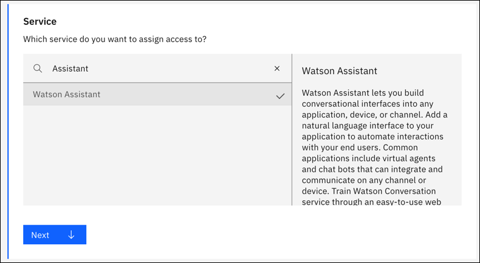
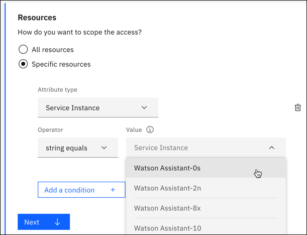
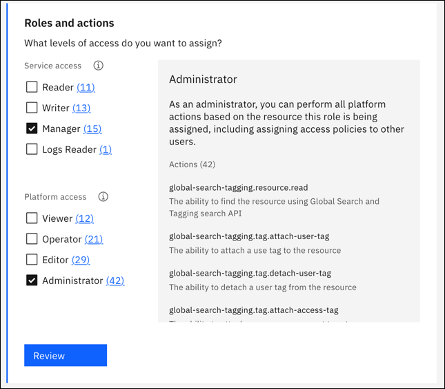
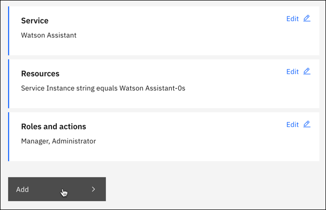
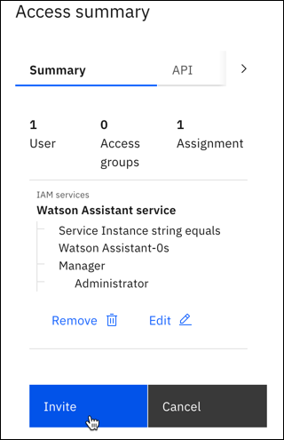

---

copyright:
  years: 2020, 2022
lastupdated: "2022-07-19"

subcollection: watson-assistant

---

{:shortdesc: .shortdesc}
{:new_window: target="_blank"}
{:deprecated: .deprecated}
{:important: .important}
{:note: .note}
{:tip: .tip}
{:pre: .pre}
{:codeblock: .codeblock}
{:screen: .screen}
{:javascript: .ph data-hd-programlang='javascript'}
{:java: .ph data-hd-programlang='java'}
{:python: .ph data-hd-programlang='python'}
{:swift: .ph data-hd-programlang='swift'}

{{site.data.content.classiclink}}

# Managing access
{: #access-control}

If you need to collaborate with others on your assistants, you can quickly add users with Administrator and Manager access from the **Manage** menu. To manage access to your assistants, use the [Identity and Access Management (IAM) page](https://cloud.ibm.com/iam/users) in IBM Cloud.
{: shortdesc}

## Adding users from the Manage menu
{: #access-control-add-users}

In the new {{site.data.keyword.conversationshort}}, each assistant contains all the draft and live resolution methods (actions and search integration) and channels you add (such as web chat, Facebook, or Slack), so the simplest way to provide access is to add users to your {{site.data.keyword.conversationshort}} instance with Administrator and Manager permissions. This gives other users the same level of access to a {{site.data.keyword.conversationshort}} service instance as you, and ensures they have all the privileges they need to build and deploy any assistant. If you want to add users without full access or manage the access of existing users, see the steps for [Managing access with Identity and Access Management](#access-control-iam).

To add users with Administrator and Manager access, complete the following steps:

1.  Open the **Manage** menu.

    

1. Click **Add users**.

1. Enter the email addresses of the users that you want to provide full access to. Separate email addresses with commas, spaces, or line breaks.

    

    Adding users from this menu enables them to read, write, and manage all aspects of the instance.
    {: important}

1. Click **Submit**.

After you click **Submit**, any user that you invite receives an email to access the assistant. After they accept the invite, they can now work on your assistant with you.

## Managing access with Identity and Access Management
{: #access-control-iam}

Another way to add users to your assistants is using Identity and Access Management (IAM). If you want to add users, and you don't want them to have full Administrator and Manager access, use IAM to add them. From IAM, you can also manage access roles of those users that are already added to your assistants.

### Opening Identity and Access Management
{: #access-control-open-iam}

1.  Open the **Manage** menu.

    

1.	Click **Manage users**.

1.	In **Access and permissions**, click **Identity and Access Management** in step 2.

    {: caption="Access and permissions" caption-side="bottom"}

### Adding users in Identity and Access Management
{: #access-control-manage-access}

1.	In IAM, click **Invite users**.

1.	Enter the email address of the person who needs access.

1.	In **How do you want to assign access?**, choose **Access policy**.

    {: caption="Access policy" caption-side="bottom"}

1.	In **Service**, choose **{{site.data.keyword.conversationshort}}**, then click **Next**.

    {: caption="Service" caption-side="bottom"}

1.	In **Resources**, choose either **All resources** or **Specific resources**. 

    If you choose **All resources**, the user can access all the instances of {{site.data.keyword.conversationshort}} in your account.

    If you choose **Specific resources** you can narrow access in **Attribute type**. Choices include:

    | Attribute type | Description |
    | - | - |
    | Assistant, Environment or Skill ID | ID value from Assistant or Environment settings |
    | Region | Service instances in a specific region, for example, Dallas or London |
    | Resource type | Assistant ID or Skill ID |
    | Resource group | Choose a resource group you might have created |
    | Service instance | Specific service instance of {{site.data.keyword.conversationshort}} |
    {: caption="Attribute types" caption-side="top"}

    {: caption="Resources" caption-side="bottom"}

1.	In **Roles and actions**, select the [service role](#access-control-service-roles) that you want the user to have. Service access controls what a person can do in {{site.data.keyword.conversationshort}}. Then select the [platform role](#access-control-platform-roles) that you want the user to have. Platform access controls a person's ability to access a service instance in {{site.data.keyword.cloud_notm}}. Then click **Review**.

    {: caption="Roles and actions" caption-side="bottom"}

1.	Click **Add** to add the access policy.

    {: caption="Add button" caption-side="bottom"}

1.	To finish, click the **Invite** button.

    {: caption="Invite button" caption-side="bottom"}

The user you invited appears in your list with the status of **Processing**. After they accept the invite, status changes to **Active** and can now work on your assistants with you.

### Service roles
{: #access-control-service-roles}

A service role controls what a person can do in {{site.data.keyword.conversationshort}}.

| Role | Open assistants | Create assistants | Edit assistants | Delete assistants | Analytics | 
|---|---|---|---|---|---|
| **Reader** |  | | | | | |
| **Writer** |  |  |  |  | |  |
| **Manager** |  |  |  |  |  |
| **Logs Reader** | | | | |  |
{: caption="Table 1. Service role details" caption-side="top"}

Use Logs Reader in combination with the Reader or Writer role to provide access to the Analytics page. The roles apply to the specific instance, assistant, or environment you specify in the access policy.{: note}

### Platform roles
{: #access-control-platform-roles}

A platform role controls a user's ability to work with a service instance in {{site.data.keyword.cloud_notm}}.

| Role | Open | Modify | Delete | Manage access |
|---|---|---|---|---|
| **Viewer** |  | | | |
| **Operator** |  |  | | | |
| **Editor** |  |  | | | |
| **Administrator** |  |  |  |  |
{: caption="Table 2. Platform role details" caption-side="top"}
