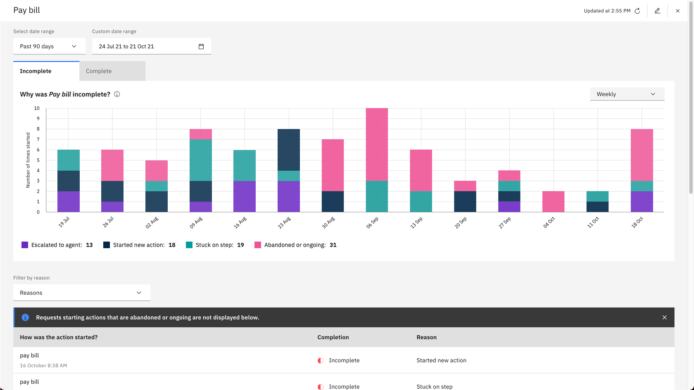
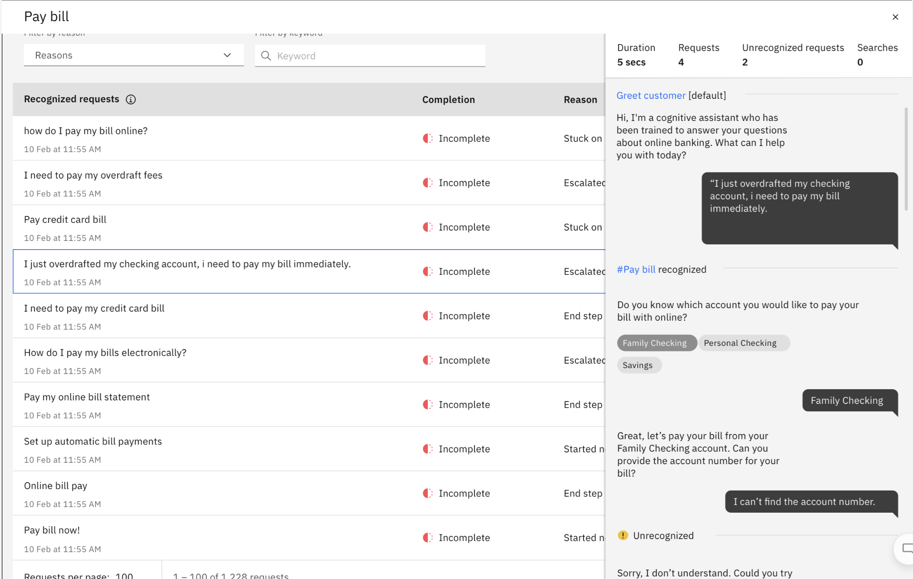

---

copyright:
  years: 2021, 2022
lastupdated: "2022-06-30"

subcollection: watson-assistant

---

{:shortdesc: .shortdesc}
{:new_window: target="_blank"}
{:external: target="_blank" .external}
{:deprecated: .deprecated}
{:important: .important}
{:note: .note}
{:tip: .tip}
{:pre: .pre}
{:codeblock: .codeblock}
{:screen: .screen}
{:javascript: .ph data-hd-programlang='javascript'}
{:java: .ph data-hd-programlang='java'}
{:python: .ph data-hd-programlang='python'}
{:swift: .ph data-hd-programlang='swift'}

{{site.data.content.classiclink}}

# Understand your most and least successful actions
{: #analytics-action-completion}

The **Action completion** page of {{site.data.keyword.conversationshort}} provides an overview of how all your assistant's actions are doing. The page allows you to:
- Understand how well users are progressing through the action steps you have created
- Identify problem areas within actions
- Investigate why users are having issues where they might escalate to a person, start a new action, get stuck on a step, or stop the conversation

## Defintion of completion
{: #completion-definition}

*Completion* measures how often within a given time period users reach the end step of an action.

### Reasons for completion
{: #complete-reasons}

An action is considered complete when:
- A final (end) step is reached
- Search reached a final step
- A subaction reached a final step, returns to a parent action, and the parent action ends because `End this action after subaction is completed` is selected
- Connect to agent transfer occurs according to the step response and without involving the [Fallback action](/docs/watson-assistant?topic=watson-assistant-handle-errors#fallback-action)
- The last step of the action has been executed and there are no more steps to execute

### Reasons for incompletion
{: #incomplete-reasons}

An action is considered incomplete for these reasons:

| Reason | Description |
| ------ | ---------- |
| Escalated to agent | The user explicitly asks for a human agent, triggering the [Fallback action](/docs/watson-assistant?topic=watson-assistant-handle-errors#fallback-action). For more information, see [When your customer asks to speak to a human agent](/docs/watson-assistant?topic=watson-assistant-handle-errors#when-your-customer-asks-to-speak-to-a-human-agent). Or, the user chooses human agent escalation from the list of [suggestions in web chat](/docs/watson-assistant?topic=watson-assistant-web-chat-suggestions). |
| Started a new action | The user changes the topic of the conversation, triggering another action, and either doesn't return to the original action or the other action is also incomplete. |
| Stuck on a step |  Triggered during step validation where a user exceeds the maximum retries for the particular step. Default tries is set to 3, but you can change this setting. See [Customizing validation for a response](/docs/watson-assistant?topic=watson-assistant-handle-errors#customizing-validation-for-a-response) for more information. |
| Abandoned | An action is considered abandoned if it was not completed after 1 hour of inactivity and doesn't meet the criteria for any other incompletion reason (escalated to agent, started a new action, or stuck on a step). |

## Improving completion
{: #analytics-improving-completion}

To help you identify actions that need improvement, the **Action completion** page is organized into a **How often** chart and an **Actions** table. The **How often** chart shows either the percentage of complete actions or the number of complete and incomplete actions during a timeframe. Use the icon in the upper right of the chart to toggle between a line chart that shows the percentage of complete actions or a bar chart that shows the number of complete and incomplete actions. The **Actions** table provides number of requests, total incomplete, and completion percentage per action.

You can use the **Actions** table to focus on improving the completion of your actions. **Incomplete** results provide a focus area where you can make the biggest impact. The actions with the highest number of incompletions means these are the actions with the most users unable to get their questions answered or requests resolved.

To work on a specific action, click on the action name in the table. A page opens with completion details for that single action.

The *Incomplete* and *Complete* tabs provide details by timeframe. The *Incomplete* tab bar chart shows data for the four incompletion reasons. The *Complete* tab bar chart is organized by conversations either completed by the assistant or completed by a planned `connect to agent` response.

As you click on each tab, a table below the chart shows the list of either incomplete or complete requests. To explore individual requests in detail, you can click on each one. A panel opens showing the full back and forth between your customer and the assistant, including step interactions. The panel also provides a summary of how many requests there were, how many were recognized, whether search was initiated, and the duration of the conversation.

### Editing an action
{: #analytics-edit-action}

After you decide on changes you want to make to improve the action, click the edit icon in the header for the single action, which opens your action for further work on its steps.

