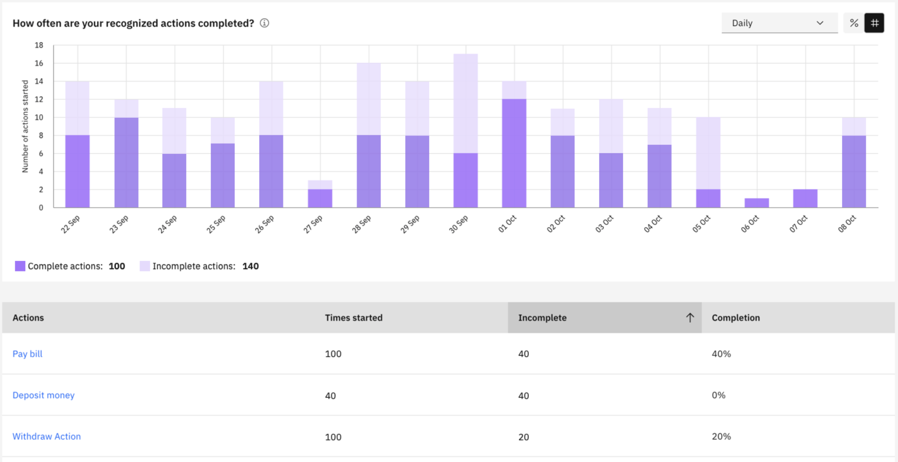

---

copyright:
  years: 2021
lastupdated: "2021-09-17"

subcollection: watson-assistant

---

{:shortdesc: .shortdesc}
{:new_window: target="_blank"}
{:external: target="_blank" .external}
{:deprecated: .deprecated}
{:important: .important}
{:note: .note}
{:tip: .tip}
{:pre: .pre}
{:codeblock: .codeblock}
{:screen: .screen}
{:javascript: .ph data-hd-programlang='javascript'}
{:java: .ph data-hd-programlang='java'}
{:python: .ph data-hd-programlang='python'}
{:swift: .ph data-hd-programlang='swift'}

{{site.data.content.classiclink}}

# Understand your most and least successful actions
{: #analytics-action-completion}

The **Action completion** page of {{site.data.keyword.conversationshort}} provides an overview of how all your assistant's actions are doing. The page allows you to:
- Understand how well users are progressing through the action steps you have created
- Identify problem areas within actions
- Investigate why users are having issues where they might escalate to a person, start a new action, get stuck on a step, or stop the conversation

## Defintion of completion
{: #completion-definition}

*Completion* measures how often within a given time period users reach the end step of an action.

### Reasons for completion
{: #complete-reasons}

An action is considered complete when:
- A final (end) step is reached
- Search reached a final step
- A subaction reached a final step, returns to a parent action, and the parent action ends because `End this action after subaction is completed` is selected
- Connect to agent transfer occurs according to the step response and without involving the [Fallback action](/docs/watson-assistant?topic=watson-assistant-handle-errors#fallback-action)
- The last step of the action has been executed and there are no more steps to execute

### Reasons for incompletion
{: incomplete-reasons}

An action is considered incomplete for these reasons:

| Reason | Description |
| ------ | ---------- |
| Stuck on a step |  Triggered during step validation where a user exceeds the maximum retries for the particular step. Default tries is set to 3, but you can change this setting. See [Customizing validation for a response](/docs/watson-assistant?topic=watson-assistant-handle-errors#customizing-validation-for-a-response) for more information. |
| Started a new action | The user changes the topic of the conversation, triggering another action, and either doesn't return to the original action or the other action is also incomplete.
| Escalate to agent | The user explicitly asks for a human agent, triggering the [Fallback action](/docs/watson-assistant?topic=watson-assistant-handle-errors#fallback-action). For more information, see [When your customer asks to speak to a human agent](/docs/watson-assistant?topic=watson-assistant-handle-errors#when-your-customer-asks-to-speak-to-a-human-agent). Or, the user chooses human agent escalation from the list of [suggestions in web chat](/docs/watson-assistant?topic=watson-assistant-deploy-web-chat#deploy-web-chat-alternate). |
| Abandoned or ongoing | If the action is neither complete or incomplete because of the reasons above (stuck on step, started a new action, or escalate to agent) then it's considered abandoned or ongoing. |

## Improving completion
{: analytics-improving-completion}

To help you identify actions that need improvement, the **Action completion** page is organized into a **How often** chart and an **Actions** table. The **How often** chart shows the number of complete and incomplete actions during a time frame. The **Actions** table provides number of requests, total incomplete, and completion percentage per action.

You can use the **Actions** table to focus on improving the completion of your actions. **Total incomplete** results provide a focus area where you can make the biggest impact. The actions with the highest number of incompletions means these are the actions with the most users unable to get their questions answered or requests resolved.

