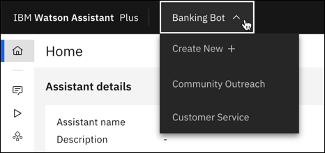

---

copyright:
  years: 2018, 2022
lastupdated: "2022-02-07"

subcollection: watson-assistant

---

{:shortdesc: .shortdesc}
{:new_window: target="_blank"}
{:external: target="_blank" .external}
{:deprecated: .deprecated}
{:important: .important}
{:note: .note}
{:tip: .tip}
{:pre: .pre}
{:codeblock: .codeblock}
{:screen: .screen}
{:javascript: .ph data-hd-programlang='javascript'}
{:java: .ph data-hd-programlang='java'}
{:python: .ph data-hd-programlang='python'}
{:swift: .ph data-hd-programlang='swift'}

{{site.data.content.classiclink}}

# Adding more assistants
{: #assistant-add}

You can create multiple assistants in your instance. The number of assistants you can create depends on your {{site.data.keyword.conversationshort}} [plan type](https://www.ibm.com/products/watson-assistant/pricing/){: external}. There is also a limit of 100 assistants per service instance.

If you need to add more assistants, follow these steps:

1.  In the top navigation, click the name of your current assistant, then choose **Create New**:

    

1.  Add details about the new assistant:

    - **Assistant name**: A name no more than 100 characters in length. A name is required.
    - **Description**: An optional description no more than 200 characters in length.
    - **Assistant language**: The language the assistant uses in conversations. Learn more about [language support](/docs/watson-assistant?topic=watson-assistant-admin-language-support).

1.  Click **Create assistant**.

## Switching between assistants

To switch to another assistant in your instance:

1.  In the top navigation, click the name of your current assistant.

    

1.  Choose the assistant you want to open.
