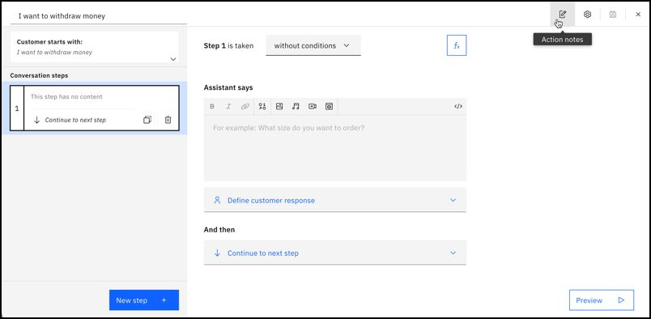
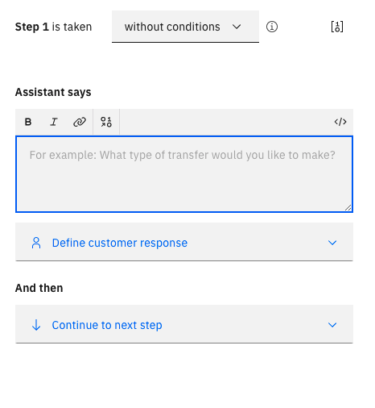
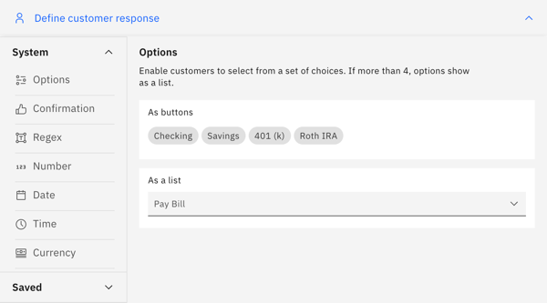
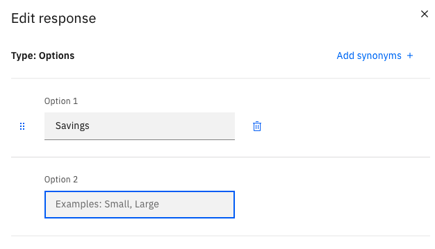
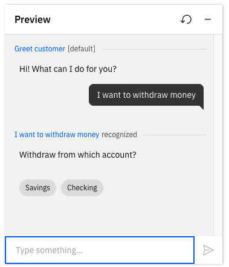
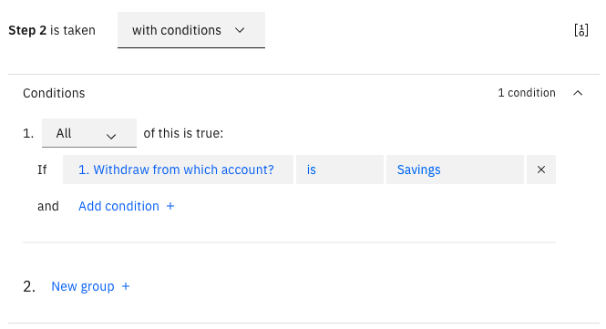
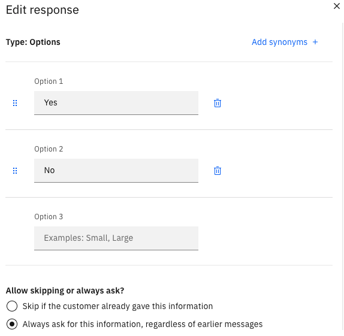
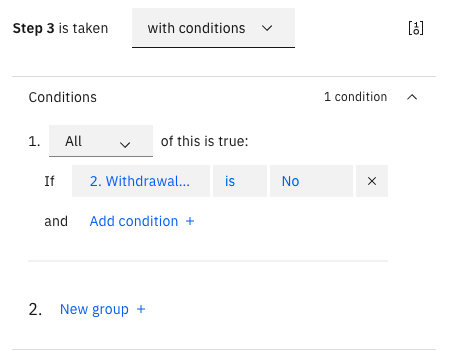

---

copyright:
  years: 2018, 2022
lastupdated: "2022-08-05"

subcollection: watson-assistant

---

{:shortdesc: .shortdesc}
{:new_window: target="_blank"}
{:external: target="_blank" .external}
{:deprecated: .deprecated}
{:important: .important}
{:note: .note}
{:tip: .tip}
{:pre: .pre}
{:codeblock: .codeblock}
{:screen: .screen}
{:javascript: .ph data-hd-programlang='javascript'}
{:java: .ph data-hd-programlang='java'}
{:python: .ph data-hd-programlang='python'}
{:swift: .ph data-hd-programlang='swift'}

{{site.data.content.classiclink}}

# Overview: Editing actions
{: #build-actions-overview}

Like a human personal assistant, the assistant you build will help your customers perform tasks and answer questions. To accomplish this, you define actions for the assistant.
{: shortdesc}

An _action_ represents a discrete outcome you want your assistant to be able to accomplish in response to a user's request. An action comprises the interaction between a customer and the assistant about a particular question or request. This interaction begins with the user input that starts the action (for example, `I want to withdraw money`). It might then include additional exchanges as the assistant gathers more information, and it ends when the assistant carries out the request or answers the customer's question.

## Creating and editing an action
{: #build-actions-overview-create}

To see how actions work and how you build one, let's go through an example.

When you create a new action, {{site.data.keyword.conversationshort}} prompts you for an example of the customer input that starts the action. This text is also used as the default name for the action, but you can edit the action name later.


Type `I want to withdraw money` and then click **Save** to create the action.

Initially, you only need to specify one example of typical user input that starts the action. You can add more examples of user input later. For more information, see [Understand your user's questions or requests](/docs/watson-assistant?topic=assistant-understand-questions)
{: tip}

## Using the action editor
{: #build-actions-overview-use}

After you create the action, the action editor opens.



The editor window shows the parts of an action:

- The **Customer starts with:** tile shows the customer input that starts the action. You can click this tile to edit the example text or add more examples, but we'll leave it as is for now.

- Under **Conversation steps**, you can see the steps that make up the action. A step is an interaction between the assistant and the customer; steps are executed in order, from first to last. You can reorder the steps in an action by clicking and dragging steps in the list.

- The **Preview** button opens a pane that shows you how the assistant responds to customer input. You can preview the assistant at any time to see the effect of changes you have made.

The action editor supports basic Markdown syntax.
{: tip}

## Steps
{: #build-actions-overview-steps}

An action consists of one or more _steps_. The steps in an action define the conversation turns that follow the initial customer input that triggered the action. In a simple case, a step might consist of a direct answer to a question from the customer; for example, if the customer asks `What are your business hours?`, a one-step action might reply with `We are open Monday through Friday from 9 AM to 5 PM.`.

More commonly, though, an action requires multiple steps in order to fully understand the customer's request. For our `I want to withdraw money` example, we need more information:

- Which account should the money come from?
- What is the amount to withdraw?

Each of these follow-up questions represents a step in the action.

### Editing a step
{: #build-actions-overview-edit-step}

Within a step, you define the following things:

- Any conditions that determine whether the step is processed at run time. (By default, a step is always processed if matching user input is received.)
- What the assistant says to the customer when the step is processed.
- Rules for how the customer can reply to what the assistant says (if any response is expected).
- What to do after the step finishes.



Let's edit step 1 to find out which account the customer wants to withdraw money from:

1. In the **Step 1 is taken** field, leave the default value of **without conditions**. This step is always required for any withdrawal.

1. In the **Assistant says** field, type `Withdraw from which account?`.

1. Click **Define customer response**.

    

    Because we are asking the user to select from a list of predefined choices, click **Options**. The Edit Response window opens.

1. In the **Option 1** field, type `Savings`. As soon as you enter a value for option 1, a field appears for options 2.

    

    Navigate to **Option 2** and type `Checking`.

1. For **Allow skipping or always ask?**, select **Skip if the customer already gave this information**. This option tells the assistant to skip this step if it recognizes that the customer already specified the account type previously; for example, if the initial customer input was `I want to withdraw money from my savings account`, we don't need to ask again.

    Click **Apply** to save the customer response.

1. Now we can check to see if the step works like we expect. Click **Preview** to open the Preview pane, and type `I want to withdraw money`:

    

    As expected, the assistant now prompts you to select the account you want to withdraw money from.

### Duplicating a step
{: #build-actions-overview-duplicate-step}

You can duplicate a step so you don't have to re-create variable settings and customizations. Duplicating a step is helpful when you need to add a step similar to a previous step, but with minor modifications.

Complete the following steps to duplicate a step:

1. Click the **Duplicate** icon on the step that you want to duplicate.

    

    A step appears immediately following the step that you duplicated. This step is identical to the duplicated step and displays a blue circle in the upper right to indicate that the step is a duplicate.

    

1. Edit the information in the new step as necessary.

### Adding conditional steps
{: #build-actions-overview-conditional-steps}

Suppose our bank charges a fee for withdrawals from checking accounts, and we need to confirm that the customer understands this. This means that our action needs to have slightly different behavior depending on which kind of account the customer selects. We can handle this using step conditions.

When a step asks for information from the user, the user's response is stored as an _action variable_. By referring to the action variables stored by previous steps, you can construct step conditions based on your customer's previous responses.

1. Click **New step**.

1. In the **Step 2 is taken** field, select **with conditions**. The **Conditions** section expands.

    

1. By default, a condition is automatically created based on the action variable stored by the previous step (`Withdraw from which account?`). However, by default it is checking for a value of `Savings`, which is not what we want. Click the value field and select `Checking` instead.

    

1. In the **Assistant says** field, type `Withdrawals from checking accounts might incur a fee. Do you want to continue?`

1. Click **Define customer response** and select **Options**. This time the options are simply `Yes` and `No`. Because we want to make sure the customer always agrees explicitly, select **Always ask for this information, regardless of earlier messages**.

    

    Click **Apply** to save the customer response.

Now we need another conditional step to handle the situation where the customer has decided not to continue.

1. Click **New step**.

1. In the **Step 3 is taken** field, select **with conditions**.

1. Edit the condition so it checks to see if the customers response to step 2 was `No`.

    

1. In the **Assistant says** field, type `Canceling transaction.`.

1. In the **And then** field, select **End the action**. If this step is executed (meaning that the customer has decided not to proceed), no subsequent steps in the action will be executed.

We don't need a conditional step to handle a response of `Yes` in step 2, because in that situation processing just continues as normal.
{: note}

### Getting the amount
{: #build-actions-overview-get-amount}

We need one more piece of information before we can complete the customer's request: the amount of money to withdraw.

1. Click **New step**.

1. In the **Assistant says** field, type `How much do you want to withdraw?`.

1. Click **Define customer response**. This time we need the customer to specify a monetary amount, so select **Currency**. There are no more details you need to specify for a currency amount, so it is immediately added to the step.

### Finishing the action
{: #build-actions-overview-finish-action}

We now have all the information we need. For our example, we're not going to implement any real logic for making a withdrawal, but we can send a final message summing up what we're doing.

To do this, we need to insert action variables (representing customer responses from previous steps) into our response. At run time, these action variables will be replaced with the actual values supplied by the customer.

1. Click **New step**.

1. Now we need to build a confirmation message that says "OK, we will withdraw *amount* from your *account_type* account."

    To create this response, type the text of the message in the **Assistant says** field, but in place of the variable values, click the **Insert a variable**  icon to insert references to action variables:

    - For *amount*, select **4. How much do you want to withdraw?**.
    - For *account_type*, select **1. Withdraw from which account?**.

    

1. Because this is the last step in the action, you don't need to specify any customer response.

If you decide a step is no longer needed, you can delete it from the action. To delete a step, click the **Delete**  icon on the tile for the step.
{: tip}

## Testing the action
{: #build-actions-overview-test}

We can now test the action to make sure it's working like we expect. Click **Preview** to open the Preview pane. (If the text from a previous test is still shown, click the **Refresh**  icon to restart the conversation.)

Start by typing `I want to withdraw money`. Try various permutations of your input to test how the assistant behaves:

- Try selecting both `Savings` and `Checking`. Confirm that if you select `Checking`, the assistant warns you about incurring a fee and asks if you want to continue, but if you select `Savings`, it proceeds without the warning.

- When you select `Checking`, try both responses when the assistant asks if you want to continue. Confirm that if you select `No`, the action ends.

- Try including additonal information in your initial message. For example, try typing `I want to withdraw $50 from my savings account`. Confirm that the assistant does not ask you again to specify the information you already provided.

That's it! You have built a simple action that includes multiple steps, collects information that it stores as action variables, and conditions its responses based on what your customer chooses. There is a lot more you can do with actions, but all of it is built on this basic pattern.

## Managing actions
{: #build-actions-overview-manage}

Use different {{site.data.keyword.conversationshort}} capabilities to manage your actions workflow within a single assistant and between multiple assistants.

### Duplicating an action
{: #build-actions-overview-manage-duplicate}

You can duplicate an action to reuse information in a new action. When you duplicate an action, the new action includes everything except example phrases. Click the overflow menu on the action you want and select **Duplicate**.

### Uploading intents as actions
{: #build-actions-overview-manage-upload-intents}

If you created intents in the classic {{site.data.keyword.conversationshort}} experience, you can migrate your intents to actions in the new {{site.data.keyword.conversationshort}} experience. When you upload intents, each intent is created as a new action. All phrases corresponding to an intent are created as example phrases for the new action. This can provide a helpful starting point when you are ready to start building actions in the new experience.

1. Download the intents that you want to migrate to actions from the classic {{site.data.keyword.conversationshort}} experience. For more information, see [Downloading intents](/docs/watson-assistant?topic=watson-assistant-migrate-intents-entities#migrate-intents-download). The format for each line in the file is as follows:
    ```text
    <phrase>,<intent>
    ```
    where `<phrase>` is the text of a user example phrase, and `<intent>` is the name of the intent. For example:
    ```text
    Tell me the current weather conditions.,weather_conditions
    Is it raining?,weather_conditions
    What's the temperature?,weather_conditions
    Where is your nearest location?,find_location
    Do you have a store in Raleigh?,find_location
    ```

1. From the main actions page, click the **Upload** icon .

1. Select the intents file that you downloaded.

    The file is validated and uploaded, and the system trains itself on the new data.

    The intents in column 2 are created as new actions, and the phrases in column 1 are created as example phrases for the corresponding action. For example, if you upload the example from step 1, two new actions are created for the `weather_conditions` and `find_location` intents. The underscores (`_`) in the intent names are replaced with spaces, for example, the `weather_conditions` intent becomes the `weather conditions` action.

    In this example, the `weather_conditions` action will have three example phrases: `Tell me the current weather conditions.`, `Is it raining?`, and `What's the temperature?`. The `find_location` action will have two example phrases: `Where is your nearest location?` and `Do you have a store in Raleigh?`.
