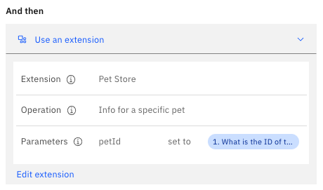
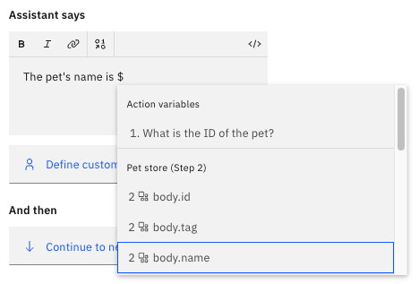

---

copyright:
  years: 2021
lastupdated: "2022-03-01"

subcollection: watson-assistant

---

{:shortdesc: .shortdesc}
{:new_window: target="_blank"}
{:external: target="_blank" .external}
{:deprecated: .deprecated}
{:important: .important}
{:note: .note}
{:tip: .tip}
{:pre: .pre}
{:preview: .preview}
{:codeblock: .codeblock}
{:screen: .screen}
{:javascript: .ph data-hd-programlang='javascript'}
{:java: .ph data-hd-programlang='java'}
{:python: .ph data-hd-programlang='python'}
{:swift: .ph data-hd-programlang='swift'}
{:table: .aria-labeledby="caption"}
{:video: .video}

{{site.data.content.classiclink}}

# Calling a custom extension
{: #call-extension}

An extension is an integration with an external service. By calling an extension from an action, your assistant can send requests to the external service and receive response data it can use in the conversation.
{: shortdesc}

For example, you might use an extension to interact with a ticketing or customer relationship management (CRM) system, or to retrieve real-time data such as mortgage rates or weather conditions. Response data from the extension is then available as action variables, which your assistant can use in the conversation.

For information about how to build a custom extension, see [Build a custom extension](/docs/watson-assistant?topic=watson-assistant-build-custom-extension).

Calls to extensions cannot be tested using the assistant preview pane. To test an assistant that uses extensions, use the **Preview** page or a preview link. For more information, see [Previewing and sharing your assistant](/docs/watson-assistant?topic=watson-assistant-preview-share).
{: #note}

## Calling the extension from a step
{: #call-extension-from-step}

To call a custom extension from an action:

1. In the action editor, create or open the step from which you want to call the extension.

1. In the step editor, click **And then**.

1. Click **Use an extension**.

1. In the **Extension setup** window, specify the following information:

    - In the **Extension** field, select the extension you want to call.

    - In the **Operation** field, select the operation you want to perform.

1. Specify values for each of the required input parameters. To assign a value to a parameter, click the input field for the value and select from the list of available variables.

    

    Each parameter has a data type (such as _number_ or _string_). The variable you select must be compatible with the data type of the parameter; for more information, see [Compatible response types for parameters](#parameter-response-types).

    You cannot currently use an expression to specify a parameter value. If you need to use an expression, insert a step before you call the extension, and use that step to assign the expression to an action variable. You can then use the variable as the parameter value.
    {: note}

    You must specify values for all required parameters before you can proceed.

1. If you want to specify a value for any optional parameters, click **Optional parameters** and then repeat this process for each optional parameter you want to use.

1. Click **Apply**.

The **And then** section of the step editor now shows an overview of the call to the extension:

If you need to make changes, click **Edit extension** to reopen the **Extension setup** window.

### Compatible response types for parameters
{: #parameter-response-types}

Variables contain values that are derived from customer responses. When you assign a variable to a parameter, the variable you choose must have a customer response type that is compatible with the data type of the parameter. (for example, a _number_ parameter must be assigned a numeric value rather than text.)

The following table shows the possible customer response types and the parameter data type compatible with each.

| Customer response type | Compatible data types           | Notes |
|------------------------|---------------------------------|-------|
| options                | `string`                        | A selected option is always treated as a string, even if it is a numeric value. |
| number                 | `number`\n`integer`             | A floating-point number passed as the value for an `integer` parameter might cause an error, depending on the behavior of the REST API. |
| date                   | `string`                        | Dates are rendered as `YYYY-MM-DD`. |
| time                   | `string`                        | Times are rendered as `HH:MM:SS` in 24-hour format, converted to the user's time zone. |
| Currency               | `number`\n`integer`             |       |
| Percent                | `number`\n`integer`             | A percent value is passed as an integer (so `75%` becomes `75`). |
| Free text              | `string`                        |       |
| Regex                  | `string`                        |       |
{: caption="Compatible response types for parameters" caption-side="top"}

## Accessing extension response data
{: #extension-access-response}

After you call an extension, values from the response data are stored in special action variables that you can access in subsequent steps.

You can access these variables in the same way you access other action variables. You can reference it in the **Assistant says** text, evaluate it as part of a step condition, or assign it to a session variable so other actions can access it.

The response variables are shown in the list of available actions, categorized under the name of the extension:

 Each variable represents an atomic value (such as a string or number) from the response body. This value might be a root property of the response body, or it might be part of an object nested within the response body. The name of each variable uses dot notation to show the the path to the property within the response body (for example, `body.name` or `customer.address.zipcode`).
