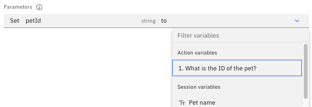
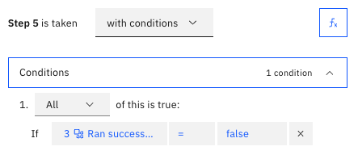
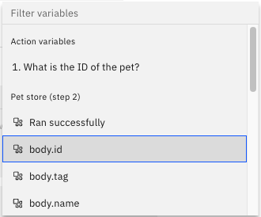
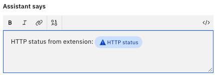

---

copyright:
  years: 2021
lastupdated: "2022-08-18"

subcollection: watson-assistant

---

{:shortdesc: .shortdesc}
{:new_window: target="_blank"}
{:external: target="_blank" .external}
{:deprecated: .deprecated}
{:important: .important}
{:note: .note}
{:tip: .tip}
{:pre: .pre}
{:preview: .preview}
{:codeblock: .codeblock}
{:screen: .screen}
{:javascript: .ph data-hd-programlang='javascript'}
{:java: .ph data-hd-programlang='java'}
{:python: .ph data-hd-programlang='python'}
{:swift: .ph data-hd-programlang='swift'}
{:table: .aria-labeledby="caption"}
{:video: .video}

{{site.data.content.classiclink}}

# Calling a custom extension
{: #call-extension}

An extension is an integration with an external service. By calling an extension from an action, your assistant can send requests to the external service and receive response data it can use in the conversation.
{: shortdesc}

For example, you might use an extension to interact with a ticketing or customer relationship management (CRM) system, or to retrieve real-time data such as mortgage rates or weather conditions. Response data from the extension is then available as action variables, which your assistant can use in the conversation.

For information about how to build a custom extension, see [Build a custom extension](/docs/watson-assistant?topic=watson-assistant-build-custom-extension).

## Calling the extension from a step
{: #call-extension-from-step}

To call a custom extension from an action:

1. In the action editor, create or open the step from which you want to call the extension.

1. In the step editor, click **And then**.

1. Click **Use an extension**.

1. In the **Extension setup** window, specify the following information:

    - In the **Extension** field, select the extension you want to call.

    - In the **Operation** field, select the operation you want to perform. (An _operation_ is a method or function supported by the extension.)

1. Specify values for each of the required input parameters. A _parameter_ is an input value sent to an operation, such as the ID of a customer record you want to retrieve or the location to use for a weather forecast.

    To assign a value to a parameter, click the input field for the value. You can then select from the list of available variables or write an expression to specify the value.

    

    Each parameter has a data type (such as _number_ or _string_). The variable you select must be compatible with the data type of the parameter; for more information, see [Compatible variables for parameters](#parameter-response-types).

    You must specify values for all required parameters before you can proceed.

1. If you want to specify a value for any optional parameters, click **Optional parameters**. You can then repeat this process for each optional parameter you want to use.

1. Click **Apply**. (If the **Apply** button is not available, check to make sure you have specified values for all required parameters.)

The **And then** section of the step editor now shows an overview of the call to the extension:

If you need to make changes, click **Edit extension** to reopen the **Extension setup** window.

### Compatible variables for parameters
{: #parameter-response-types}

To pass an input parameter value for an operation, you must select a compatible action variable or session variable.

An action variable contains a value that is based on a customer response in a previous step. A session variable might have a value based on a customer response or a value defined by an expression. (For more information about action variables and session variables, see [Using variables to manage conversation information](/docs/watson-assistant?topic=watson-assistant-manage-info).)

When you assign a value to a parameter, the variable you choose must have a customer response type that is compatible with the data type of the parameter. (For example, a _number_ parameter must be assigned a numeric value rather than text.)

The following table shows the possible customer response types and the parameter data type compatible with each.

| Customer response type | Compatible data types           | Notes |
|------------------------|---------------------------------|-------|
| options                | `string`                        | A selected option is always treated as a string, even if it is a numeric value. |
| number                 | `number`\n`integer`             | A floating-point number passed as the value for an `integer` parameter might cause an error, depending on the behavior of the REST API. |
| date                   | `string`                        | Dates are rendered as `YYYY-MM-DD`. |
| time                   | `string`                        | Times are rendered as `HH:MM:SS` in 24-hour format, converted to the user's time zone. |
| Currency               | `number`\n`integer`             |       |
| Percent                | `number`\n`integer`             | A percent value is passed as an integer (so `75%` becomes `75`). |
| Free text              | `string`                        |       |
| Regex                  | `string`                        |       |
{: caption="Compatible response types for parameters" caption-side="top"}

#### Arrays

In addition to the supported customer response types, a variable can also contain an array value. If you need to pass an array parameter to an operation, you must create an array session variable:

1. Create a new session variable, either using the **Set variable values** icon in the step editor or from the **Variables > Created by you** page. (For more information about how to create a session variable, see [Creating a session variable](/docs/watson-assistant?topic=watson-assistant-manage-info#create-session-variable).)

1. In the **Type** field, leave **Any** selected.

1. In the **Initial value** field, click the **Use expression** toggle to enable it. Type an expression that defines an array value (such as `["New York", "London", "Tokyo"]`, `[123, 456, 789]`, or `[]`).

Because this variable contains an array value, your actions can use expressions with array methods to access or modify the array values. For example, you might want to create a variable that initially contains an empty array (`[]`) and then use the `add()` method to build a list one element at a time. For more information about the array methods you can use in expressions, see [Array methods](/docs/watson-assistant?topic=watson-assistant-expression-methods-actions#expression-methods-actions-arrays).
{: note}

You can now select this variable as the value for a parameter that requires an array.

## Accessing extension response data
{: #extension-access-response}

After you call an extension, values from the response data are stored in special action variables that you can access in subsequent steps.

You can access these variables in the same way you access other action variables. You can reference it in the **Assistant says** text, evaluate it as part of a step condition, or assign it to a session variable so other actions can access it. The response variables are shown in the list of available variables, categorized under the name of the extension and the step from which it was called:

Each call to an extension creates a separate set of response variables. If your action calls the same extension multiple times from different steps, make sure you select the variables from the correct step.
{: #important}

Each variable represents a value from the response body. To make it easy to access these values, data is extracted from complex, nested objects and mapped to individual response variables. The name of each variable reflects its location within the response body (for example, `body.name` or `body.customer.address.zipcode`).

For example, this action step uses an expression to check the `availability` property in an extension response:

If a response variable contains an array, you can write an expression that uses array methods to access the elements of the array. For example, you might use the `contains()` method in a step condition to test whether the array contains a particular value, or the `join()` method to format data from the array as a string you can include in an assistant response. For more information about array methods, see [Array methods](/docs/watson-assistant?topic=watson-assistant-expression-methods-actions#expression-methods-actions-arrays).

## Checking success or failure
{: #extension-check-success}

You might want your assistant to be able to handle errors that occur when calling a custom extension. You can do this by checking the `Ran successfully` response variable that is returned along with the response from the call to the extension. This variable is a boolean (`true` or `false`) value.

If you define step conditions that check the `Ran successfully` variable, you can create steps that enable your assistant to respond differently depending on whether the call to the extension succeeded. (For more information about step conditions, see [Step conditions](/docs/watson-assistant?topic=watson-assistant-step-conditions).)

The following example shows a step condition that checks for a failure from an extension in step 3. By using this condition, you can create a step that tells the customer there was an error, and perhaps offers to connect to an agent for more help.

## Debugging failures
{: #extension-debug}

If your calls to an extension are failing, you might want to debug the problem by seeing detailed information about what is being returned from the external API. This is not information you would want to show to your customers, but for debugging purposes, you can create a step that uses expressions to show the response data.

### Checking the HTTP status
{: #extension-check-status}

One way of debugging failures is to check the HTTP status code. This code can help you determine if an error is being returned from the external service.

There are many possible HTTP status codes, and different methods use different status codes to indicate various types of success or failure. To check the success or failure of a call to an extension, you need to know what HTTP status codes the external service returns. These status codes are specified in the OpenAPI document that describes the external API.
{: important}

To create an expression that retrieves the HTTP status code, follow these steps:

1. Create or edit a step that comes after the call to the extension.

1. Click the **Set variable values**  icon.

1. Click **Set new value**.

1. From the drop-down list, select the session variable you want to store the HTTP status code in. If you have not already created a variable for this purpose, click **New session variable** and specify a meaningful name (for example, `HTTP status`).

1. Select **Expression** to write an expression to define the value for the session variable.

1. In the expression field, type a dollar sign (`$`) to show the list of available variables.

1. Select any variable that is a response value from the extension. (It doesn't matter which variable you select, as long as it is an extension response variable).

    

    The expression is automatically updated to show a reference to the variable you selected, in the format `${step_xxx_result_y.body.variablename}`. For example, if you selected a response variable called `body.id`, the reference might be `${step_596_result_1.body.id}`.

1. Inside the curly braces, (`{}`), edit this reference to remove `.body.variablename`. You should be left with something like `${step_596_result_1}`.

1. After the closing curly brace (`}`), add `.status`. The resulting reference identifies the status code returned from the call to the extension (for example, `${step_596_result_1}.status`).

    For more information about writing expressions, see [Writing expressions](/docs/watson-assistant?topic=watson-assistant-expressions).

1. In the **Assistant says** field, type an output message that references the variable you used to store the HTTP status. To reference the variable, type dollar sign (`$`) and select the session variable from the list.

    

1. You can now test your action and see the HTTP status code in the assistant output after the call to the extension.

### Debugging the output
{: #extension-debug-output}

For debugging purposes, you might want your assistant to show the entire response it receives from the extension (including any error messages) in the output.

To do this, create a step after the call to the extension, and in that step assign an expression to a session variable (for example, `response_body`). Construct the expression using the same method described in [the previous section](#extension-check-status), except specifying `.body` instead of `.status`.

You can then reference this variable in the **Assistant says** field to include the body of the response data in the output. If the call to the extension is successful, this shows the unformatted raw data received from the external service. In the event of a failure, it includes any error message that was received.

For more information about creating and referencing variables, see [Using variables to manage conversation information](/docs/watson-assistant?topic=watson-assistant-manage-info).
