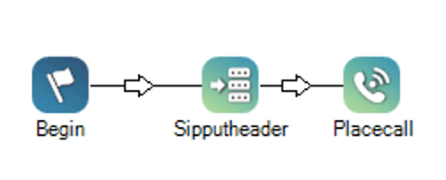
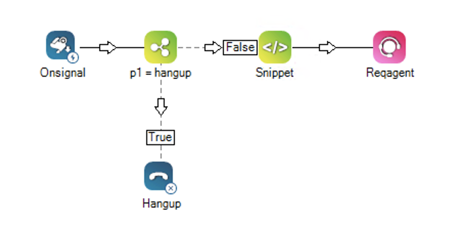
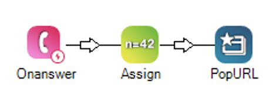

---

copyright:
  years: 2022
lastupdated: "2022-07-29"

subcollection: watson-assistant

---

{:shortdesc: .shortdesc}
{:new_window: target="_blank"}
{:external: target="_blank" .external}
{:deprecated: .deprecated}
{:important: .important}
{:note: .note}
{:tip: .tip}
{:pre: .pre}
{:codeblock: .codeblock}
{:screen: .screen}
{:javascript: .ph data-hd-programlang='javascript'}
{:java: .ph data-hd-programlang='java'}
{:python: .ph data-hd-programlang='python'}
{:swift: .ph data-hd-programlang='swift'}

{{site.data.content.classiclink}}


# Integrating with phone and NICE CXone contact center 
{: #deploy-phone-nicecxone}

Connect your assistant to a NICE CXone contact center with live agents. 
{: shortdesc}

Transfer customers from a chat with your assistant to live agents who can help them by phone. If customers ask to speak to someone, your assistant can forward them directly to customer support with the conversation history.

This integration creates a connection between your assistant and a contact center using NICE CXone.

You need a Plus or Enterprise Plan to use this feature.

## Before you begin
{: #deploy-phone-cxone-account}

You must have a NICE CXone account and phone numbers allocated for this integration. 

1.  Go to the [NICE website](https://www.nice.com/){: external}.
2.  Create an account.
3.  Follow the instructions to get phone numbers or select existing phone numbers.

## Generate NICE CXone access keys
{: #deploy-phone-cxone-accesskeys}

Access keys are used for authentication and consist of two parts: an access key ID and a secret access key. 

To generate NICE CXone access keys to use with your assistant:

1. Log in to the NICE CXone console.

1. Click the app selector   and select  **Admin**.

1. Click  **Users**, and then locate and click the user account you want to use for the integration.

1. Click the **Access Keys** tab.
1. Click **Generate New Access Key**.
1. Click **Show Secret Key**, and copy the secret key to a secure location. 

    You cannot retrieve the secret key again after you complete the next step and **Save**. You must generate a new key if the current one is lost or forgotten.

1. Click **Save**.

## Set up the integration
{: #deploy-phone-cxone-setup}

To complete setup, you must have an assistant ready to deploy, your NICE CXone access keys, and phone numbers allocated for this integration. 

To integrate your assistant with NICE CXone:

1. In the **Integrations** section on the main page for your assistant, click **Add integration**.

1. On the **Add integration** page, click **Phone**.

    Click **Create**.

1. On the **Phone** page, enter an **Integration name** and select **Integrate with your contact center**. 

    Below **Set up a phone connection**, check marks record your progress with each step.
    
    Click **Next**.

1. Select **NICE CXone** on the **Select contact center** page.
    
    Click **Next**.

1. On the **Connect to contact center** page, specify the following values:
	    - the **Authentication URL** from NICE CXone
	    - the **API URL**, which is the *Admin* API endpoint from NICE CXone
	    - the **Access key ID**
	    - the **Access key secret** 
    
    Click **Test connection** to verify the credentials. 
    
    Click **Next**.

1. On the **Phone number** page, enter a phone number you allocated for the NICE CXone integration. You can add more phone numbers later.

    Click **Next**.

1. On the **Speech to Text** page, select the instance of the {{site.data.keyword.speechtotextshort}} service you want to use.

    - If you have existing {{site.data.keyword.speechtotextshort}} instances, select the instance you want to use from the list.

    - If you do not have any existing {{site.data.keyword.speechtotextshort}} instances, click **Create new instance** to create a new Plus or Enterprise instance.

1. In the **Choose your Speech to Text language model** field, select the language you want to use.

    The list of language models is automatically filtered to use the same language as your assistant. To see all language models, toggle the **Filter models based on assistant language** switch to **Off**.

    If you created specialized custom models that you want your assistant to use, choose the {{site.data.keyword.speechtotextshort}} service instance that hosts the custom models now, and you can configure your assistant to use them later. The {{site.data.keyword.speechtotextshort}} service instance must be hosted in the same location as your {{site.data.keyword.conversationshort}} service instance. For more information, see [Using a custom language model](/docs/watson-assistant?topic=watson-assistant-phone-actions#phone-actions-custom-language).
    {: note}

    For more information about language models, see [Languages and models](/docs/speech-to-text?topic=speech-to-text-models){: external} in the {{site.data.keyword.speechtotextshort}} documentation.

    Click **Next**.

1. On the **Text to Speech** page, select the instance of the {{site.data.keyword.texttospeechshort}} service you want to use.

    - If you have existing {{site.data.keyword.texttospeechshort}} instances, select the instance you want to use from the list.

    - If you do not have any existing {{site.data.keyword.texttospeechshort}} instances, click **Create new instance** to create a new Standard instance.

    Click **Next**.

1. On the **Contact center integrations** page, click **Test connection** below the setup information you entered.

    - If **Invalid**, check your credentials and enter each again.

    - If the credentials are correct, the **Save and exit** button becomes clickable.

    Click **Save and exit**.

The connection between your assistant and NICE CXone is complete. 


### Configuring the NICE CXone script

NICE CXone provides a scripting tool that allows workflow developers to define routing flows for their contact centers in CXone.

The following actions and settings in the workflow are necessary for integration to work properly. 

#### Connecting a caller to your assistant

1. Use the [Sipputheader](https://help.nice-incontact.com/content/studio/actions/sipputheader/sipputheader.htm) action. In the **headerName** property, enter the name of the SIP header field that will contain the Contact ID. This header field is included in outgoing SIP INVITE messages to {{site.data.keyword.conversationshort}}.  

- **headerName** X-Contact-ID
- **headerValue** {ContactId}

**Sipputheader** must be executed before **Placecall**.
{: note}

1. Use a [Placecall](https://help.nice-incontact.com/content/studio/actions/placecall/placecall.htm) action to initiate an outbound call to {{site.data.keyword.conversationshort}}. In the **PhoneNumber** property, enter the phone number you allocated for this integration. 

The phone number must match the number you configured in **Use an existing phone number with an external provider** in the {{site.data.keyword.conversationshort}} user interface.
{: note}



#### Transferring a caller to a live agent

You can configure your assistant to transfer a customer to a NICE CXone live agent. 
 
The phone integration uses the [signal](https://developer.niceincontact.com/API/AdminAPI#/Contacts/Signal%20a%20Contact) REST API. The **p1** attribute is preserved for the session history key. The key can be used to fetch the conversation history and present it to a live agent. 

1. Use [Onsignal](https://help.nice-incontact.com/content/studio/actions/onsignal/onsignal.htm) to process the signal event. 

1. Save the value of the **p1** attribute:

```
sessionKey = "{p1}"
```

For example, you can use the [Snippet](https://help.nice-incontact.com/content/studio/actions/snippet/snippet.htm) action:

```
ASSIGN sessionKey = "{p1}"
```

1. Use [Reqagent](https://help.nice-incontact.com/content/studio/actions/reqagent/reqagent.htm) to transfer a call to a live agent.



#### Displaying conversation history to a live agent

Configure your script to provide a transcript of the assistant conversation to a live agent in a pop-out window. This helps the agent better understand and address a customer's needs.

1. Add an [Onanswer](https://help.nice-incontact.com/content/studio/actions/onanswer/onanswer.htm) event to your script. The  **Onanswer** event is triggered when an agent answers the call. 

1. Use [Assign](https://help.nice-incontact.com/content/studio/actions/assign/assign.htm) to store the link to the conversation history into a variable. 
**Variable** watson_url
**Value** https://web-chat.global.assistant.watson.appdomain.cloud/loadAgentAppFrame.html?session_history_key={sessionKey}

1. Use the [PopURL](https://help.nice-incontact.com/content/studio/actions/popurl/popurl.htm) action to display the conversation transcript to a live agent. 
**URL** {watson_url}



#### Disconnecting a call

The phone integration uses the same [signal](https://developer.niceincontact.com/API/AdminAPI#/Contacts/Signal%20a%20Contact) REST API for disconnecting a call.  

The **p1** attribute is set to `hangup`. You need to design your script so it can distinguish between transferring a call to a live agent and disconnecting a call. If **p1** is set to `hangup` when an **Onsignal** event is triggered, use [Hangup](https://help.nice-incontact.com/content/studio/actions/hangup/hangup.htm) to terminate a script. 


#### Transferring to a live agent when an error occurs

If an error occurs during a conversation, the phone integration disconnects the call by sending a `SIP BYE` request. 

Use [Onrelease](https://help.nice-incontact.com/content/studio/actions/onrelease/onrelease.htm) to process the BYE request and transfer a call to a live agent.  

In this example, when **Onrelease** is triggered, the script verifies whether the call was already transferred. If not, it calls the **Signal** action and sets an indication that the call is being transferred to a live agent. The indication is set using the **Assign** action. 

- **Variable** transferred
- **Value** true


**Note** If the  **Hangup** action is executed and an [**Onrelease**](https://help.nice-incontact.com/content/studio/actions/onrelease/onrelease.htm) event action is present, CXone will hang up on the caller, and the script will jump to the  **OnRelease** action. Design your script so it can distinguish whether the **OnRelease** event is triggered due to a transfer or hangup. 
{: note}


## Adding transfer support to your assistant 
{: #deploy-phone-cxone-transfer}

Configure your assistant to transfer calls to an agent using the *Connect To Agent* response_type. For instructions, see [Transferring a call to a human agent](/docs/watson-assistant?topic=watson-assistant-phone-actions#phone-actions-transfer).

Use the following format:

```json
{
  "output": {
    "generic": [
      {
        "response_type": "connect_to_agent",
        "transfer_info": {
          "target": {
            "nice_cxone": {
              "custom_data": {
                "p2": "test"
              }
            }
          }
        },
        "agent_available": {
          "message": "Ok, I'm transferring you to an agent."
        },
        "agent_unavailable": {
          "message": "Agent is unavailable."
        }
      }
    ]
  }
}
```

Parameters listed in the `custom_data` object are transferred to the [signal](https://developer.niceincontact.com/API/AdminAPI#/Contacts/Signal%20a%20Contact) REST API. 

Supported parameters are `p2`, `p3`, ... `p9`. Note that `p1` is preserved and used by the phone integration for passing the session history key into the NICE CXone script. 
