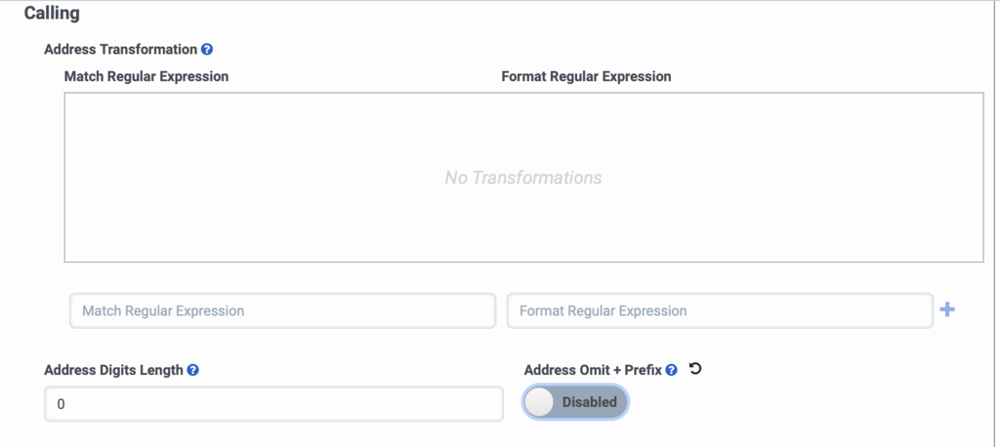
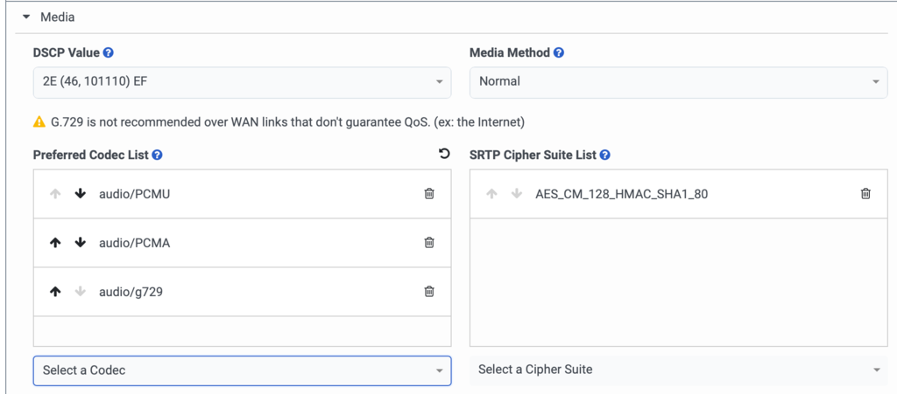
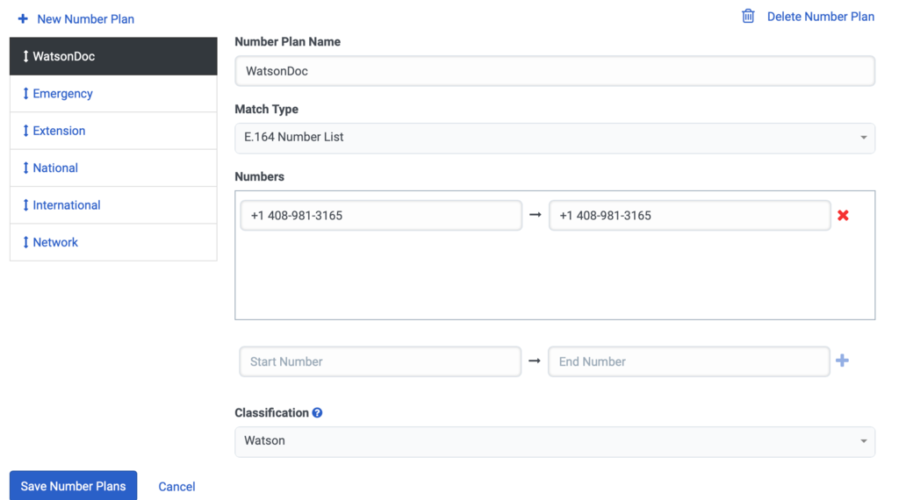
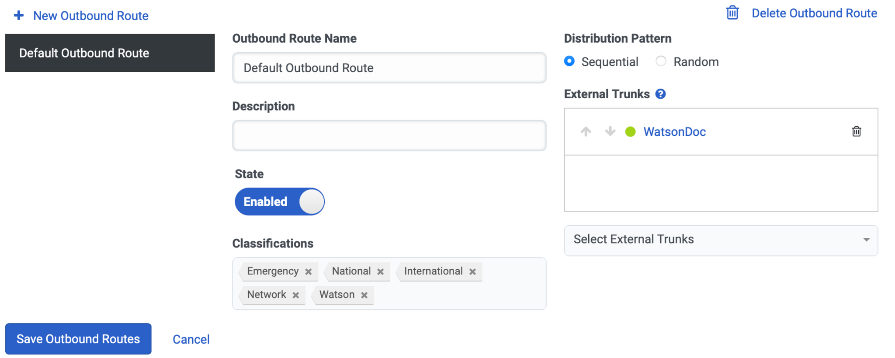
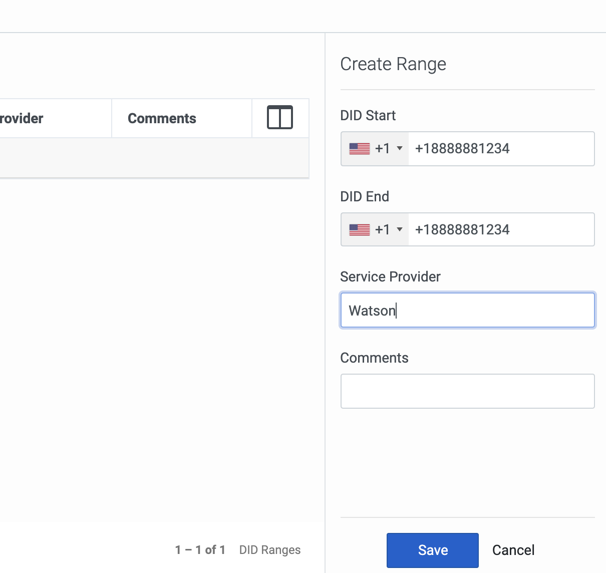
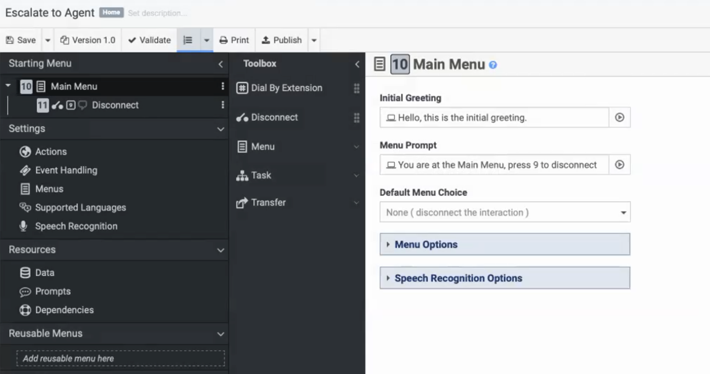
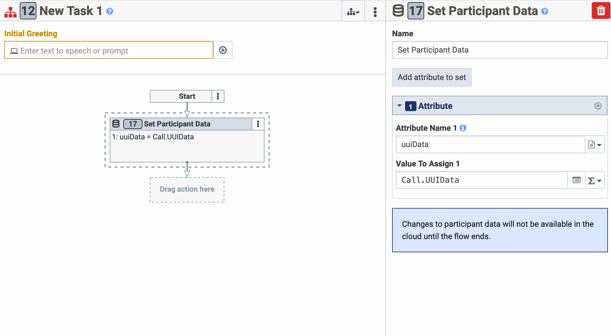
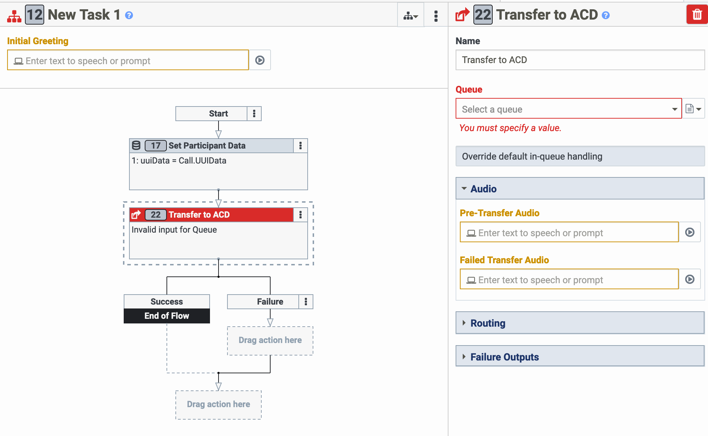

---

copyright:
  years: 2021
lastupdated: "2021-10-17"

subcollection: watson-assistant

---

{:shortdesc: .shortdesc}
{:new_window: target="_blank"}
{:external: target="_blank" .external}
{:deprecated: .deprecated}
{:important: .important}
{:note: .note}
{:tip: .tip}
{:preview: .preview}
{:pre: .pre}
{:codeblock: .codeblock}
{:screen: .screen}
{:javascript: .ph data-hd-programlang='javascript'}
{:java: .ph data-hd-programlang='java'}
{:python: .ph data-hd-programlang='python'}
{:swift: .ph data-hd-programlang='swift'}
{:video: .video}

{{site.data.content.classiclink}}

# Integrating with phone and Genesys Cloud
{: #deploy-phone-genesys}

You can use the phone integration to help your customers over the phone and transfer them to live agents inside of Genesys Cloud. If, in the course of a conversation with your assistant, a customer asks to speak to a person, you can transfer the conversation directly to a Genesys Cloud agent.

## Before you begin

To use this integration pattern, make sure you have the following:

- {{site.data.keyword.conversationshort}} Plus or Enterprise Plan (required for phone integration)
- A working assistant you are ready to deploy
- A Genesys Cloud account

## Integrating with Genesys Cloud

To integrate your assistant with Genesys Cloud, follow these steps:

1. Log into the [Genesys Cloud console](https://apps.mypurecloud.com){: external}.

1. Click **Admin**.

1. On the **Telephony** tab, click **Trunks**.

1. In the **External Trunks** section, click **Create new**. Specify the following information:

    - In the **External Trunk Name** field, type a descriptive name (for example, `Watson`).

    - In the **Type** field, select **BYOC Carrier** and then **Generic BYOC Carrier**.

    - In the **Inbound SIP Termination Identifier** field, specify any name you want to use (for example, `Watson`). This value will not be used for now, but it is required by Genesys Cloud.

    - In the **Protocol** field, select *TLS*.

    

1. Under **Outbound**, scroll to the **SIP Servers or Proxies** section. Specify the following information:

    - In the **Hostname or IP Address** field, type the SIP URI (not including `sips:`) from your Watson Assistant phone integration settings.

    - In the **Port** field, type `5061`.
    
    Click the **`+`** button.

    Currently, SIPS and digest authentication are supported.
    {: note}

    

1. Under **SIP Access Control**, add the [IP addresses](/docs/watson-assistant?topic=watson-assistant-deploy-phone-config#deploy-phone-config-byost) for the data center where your assistant is located.

1. Under **Identity**, specify the following information:

    - Toggle the **Address Omit + Prefix** switch to **Disabled**.

      

1. Under **Media**, remove **Opus** from the **Preferred Codec List**. Click **Select a Codec** and then select **g729** to add it to the list. Leave **PCMU** as the first item in the list.

  

1. Under **Protocol**
  - In the **Header/Invite** section, toggle the **Conversation Headers** switch to **Enabled**
  - Enable **Take Back and Transfer**.

  

1. Click **Save External Trunk**.

1. Under **Sites**, select the existing site you want to use this trunk with. To create a new site, specify a name and location and click **Create**.

1. Click **Number plans**. Create a new number plan and specify the following information:

    - In the **Number Plan Name** field, type a descriptive name (for example, `Watson`).

    - For **Match type**, select **E. 164 Number List**.

    - In the **Numbers** field, type a number in the **Start** and **End** fields. This does not need to be a real number; you can make up any number to use as an identifier to assign to Watson. Specify the same number in both fields.
 
      To create a PSTN number you can give to your clients, you must create a Direct Inward Dialing (DID) or Bring Your Own Carrier (BYOC) number. For more information about how to do this, see the Genesys documentation.
      {: note}

    - In the **Classification** field, type a classification name (for example, `Watson`).
    
    Click **Save Number Plans**.

    

1. Click **Outbound Routes**. You can either edit the default outbound route or create a new one. Specify the following information:

    - In the **External Trunks** field, click **Select External Trunks**. Select the trunk you created for Watson Assistant.

    - In the **Classifications** field, add the applicable classifications. This should at least include `National` and the classification you created for Watson Assistant earlier. (The `National` route is used only to simulate the call in order to make sure the trunk is operational.)

    - Toggle the **State** switch to **Enabled**.

  

1. Click **Save Outbound Routes**.

1. Go to the **Simulate Call** tab and click the **Simulate Call** button. The trunk should be shown as operational. (No actual call is made during simulation.)

  

1. Go to **Phone Management** and click **Create new**. Specify the following information:

    - In the **Phone Name** field, specify a descriptive name.

    - In the **Base Settings** field, select **WebRTCPhone**.

    - In the **Site** field, select the site you want to use.

    - In the **Person** field, select yourself.

1. In the Watson Assistant user interface, create a new phone integration. Specify the following information:

    - When prompted, select **Use an existing phone number with an external provider**.

    - Specify the phone number you assigned in the Genesys **Number Plans** setting. (Remember, this is not necessarily a real phone number; it is just the identifier you assigned.)

    - Complete the phone integration setup process. (For more information, see [Integrating with phone](/docs/watson-assistant?topic=watson-assistant-deploy-phone).)

1. In the Genesys Cloud console, click the circle in the upper left corner. Select **Phone**, and then choose the phone you created in the **Phone management** section. Set yourself as available. The phone icon on the left should now be active.

1. Click **`+`** to start a new call. Specify the number you assigned to Watson Assistant and then click **Dial**. You should now hear your assistant speak.

If you encounter any errors, click **Performance -> Interactions** and view the PCAP file to read the diagnostics.
{: note}

## Transferring to an agent

Now that your Genesys Cloud environment can connect to Watson Assistant, you can set up the ability for your assistant to transfer calls back to your human agents. To do so, follow these steps:

1. In the Genesys Cloud console, go to **DID Numbers -> DID Ranges** and create a new range. Specify the following information:

    - In the **DID Start** and **DID End** fields, specify a phone number. (Once again, you do not need to use a real phone number; you can just make up an identifier for your Genesys environment, such as `1-888-888-1234`.)

    

    - In the **Service Provider** field, type a descriptive name (for example, `Watson`).

1. If you have not already set up a queue to enable callers to wait for available agents, follow these steps to create a simple one now:

    1. Click **Admin**.

    1. Under **Contact Center**, click **Queues**.

    1. Create a new queue and give it a descriptive name.

    1. Add yourself as a member.

    1. Click **Save**.

1. Create a simple call flow. (Your business might already have something more complex for routing.)

    1. Click **Admin**.

    1. Click **Architect**.

    1. In the **Flows: Inbound Call** section, click **`+`** to create a new flow. Give it a descriptive name (for example, `Escalate to Agent`).

      

    1. In the toolbox, click **Task** and drag it into **Reusable Tasks**.

      

    1. From your toolbox, under **Data**, drag a **Set Participant Data** widget into the first action. Click on the widget and specify an attribute named **uuiData**. For the value to assign, choose the **Expression** type and specify `Call.UUIData`.
    
      

    1. From your toolbox, under **Transfer**, drag the **Transfer to ACD** widget into the first action.

      

    1. Select the queue you want to use.

    1. In the toolbox, click the **Disconnect** widget and drag it into the action after **Failure**. (This disconnects the call if the transfer fails.)

    1. Click the three dots under **Reusable tasks** and click **Set this as the starting task**. You can remove the **Initial Greeting**, because your assistant will speak before handing off the call.

    1. Click **Publish** in the menu bar to make this transfer live.

    1. Return to the main Genesys Cloud console.
    
    1. Click **Admin** and then navigate to **Call Routing** in the **Routing** section.

    1. Give the route a descriptive name (for example, `Escalate to Agent`).

    1. Under **Regular Routing**, for all calls, select your new flow.

    1. Assign the DID number you previously created.

    1. Click **Save**.

1. Make sure your assistant is configured with at least one dialog node or action step that transfers calls to an agent using the *Connect To Agent* response_type. <!-- For more information about how to do this, see [Transferring a call to a human agent](/docs/assistant?topic=assistant-dialog-voice-actions#dialog-voice-actions-transfer){: external}. We need to add this back when Anna Guri completes her updates.-->

    For the `sip.uri` parameter, use the DID number you created in Genesys Cloud, as well as the inbound SIP URI from your Genesys trunk. Use the following format:

    ```json
    {
      "output": {
        "generic": [
          {
              "response_type": "connect_to_agent",
              "transfer_info": {
                "target": {
                  "service_desk": {
                    "sip": {
                      "uri": "sip:+18883334444\\@example.com",
                      "transfer_headers_send_method": "refer_to_header"
                    }
                  }
                }
              },
              "agent_available": {
                "message": "Ok, I'm transferring you to an agent"
              },
              "agent_unavailable": {
                "message": ""
              }
          }
        ]
      }
    }
    ```

  Make sure you use the `\\` escape characters so Watson Assistant does not misinterpret the `@` as part of the entity shorthand syntax.
  {: note}

1. Make a test call and say something that initiates a transfer to an agent. In your Genesys Cloud console, you should see the transfer take place.


###  Share the conversation history with service desk agents 

To enable the service desk agent to get a quick view of the conversation history between the visitor and the assistant, set up the {{site.data.keyword.conversationshort}} Agent App app for your Genesys Pure Cloud Environment. For more information, see the documentation for the [Genesys starter kit](https://github.com/watson-developer-cloud/assistant-web-chat-service-desk-starter/tree/main/src/genesys/agentApp){: external}.