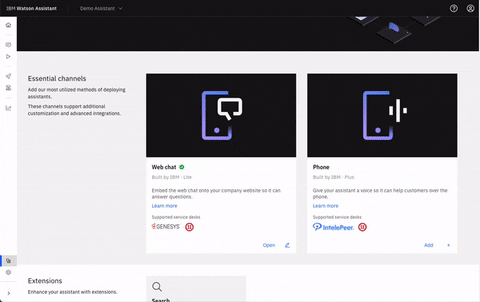
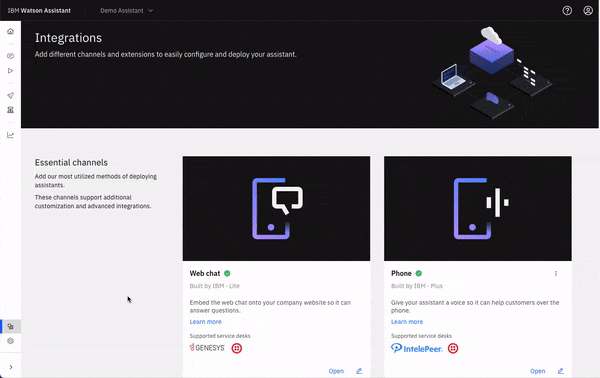

---

copyright:
  years: 2021
lastupdated: "2021-11-05"

subcollection: watson-assistant

---

{:shortdesc: .shortdesc}
{:new_window: target="_blank"}
{:external: target="_blank" .external}
{:deprecated: .deprecated}
{:important: .important}
{:note: .note}
{:tip: .tip}
{:pre: .pre}
{:codeblock: .codeblock}
{:screen: .screen}
{:javascript: .ph data-hd-programlang='javascript'}
{:java: .ph data-hd-programlang='java'}
{:python: .ph data-hd-programlang='python'}
{:swift: .ph data-hd-programlang='swift'}

{{site.data.content.classiclink}}

# Deploying your assistant
{: #deploy-assistant}

{{site.data.keyword.conversationshort}} routes your customer's questions and requests to the correct resolution source. However, before your assistant can properly route requests, you must complete the following steps:

1. Write content for your assistant
1. Publish the content
1. Connect an integration to your assistant
1. Deploy the assistant to a channel

After you connect an integration and deploy to a channel, you make your assistant available to your customers. You can find an overview visual of your progress toward completing these steps on the **Live environment** page:

## Reviewing your connected channels
Channels represent the locations or communication platforms where your assistant interacts with your users. Common examples of channels include the phone, a website, or Slack. If you do not connect your assistant to a channel, your users are not able to access the assistant.

You can review your connected channels in the following two places:

- **Draft environment** page: Channels that are connected to this environment are exposed only to your internal team for testing and not to your customers.
- **Live environment** page: Channels that are connected to this environment represent the public-facing experience of your assistant and are exposed to your customers.

You can test integrations from the **Draft environment** page and interact with your draft web chat on the **Preview** page. When you first create a new assistant, the assistant automatically connects to the web chat channel on your live environment. However, the assistant itself is not available to your customers until you embed the web chat JavaScript in the header of your website. For more information, see [Adding the web chat to your website](/docs/watson-assistant?topic=watson-assistant-deploy-web-chat).

## Connecting your assistant to a new channel
All of the channels you can connect your assistant to are available in the **Integrations** catalog. Two types of integrations are available from the **Integrations** catalog:

- Channel integrations: The location where your assistant interacts with your users, for example, over the phone, on a website, or in Slack. At least one channel is required for every assistant.
- Non-channel integrations: Add-ons to the end experience that help solve specific user problems, for example, connecting to a human agent or searching existing help content. Integrations are not required for an assistant, but they are recommended.

When you add a channel to your assistant, two instances of the channel are created. One instance of the channel is connected to the draft environment and the other instance is connected to the live environment. To connect your assistant to a new channel, go to the **Integrations** catalog. For more information about adding integrations to your assistant, see [Adding integrations](/docs/watson-assistant?topic=watson-assistant-deploy-integration-add).

You have multiple options for deploying your assistant, depending on how you want your customers to interact with it. In most cases, an assistant is deployed by using one of the following integrations:

- [Web chat integration](/docs/watson-assistant?topic=watson-assistant-deploy-web-chat): The web chat integration provides a secure and highly customizable widget you can add to your website. You can configure how and where the web chat widget appears, and you can use theming to align it with your branding and website design. If a customer needs help from a person, the web chat integration can transfer the conversation to an agent.
- [Phone integration](/docs/watson-assistant?topic=watson-assistant-deploy-phone): The phone integration enables your assistant to converse with customers on the phone by using the IBM Watson Text to Speech and Speech to Text services. If your customer asks to speak to a person, the phone integration can transfer the call to an agent.

## Updating and managing channels
Each channel has specific settings that you can adjust to adapt the end experience for your user. You can edit these settings by selecting the channel on the **Draft environment**, **Live environment**, or **Integrations** pages.

If you make an update to a channel in the draft environment on the **Draft environment** page, the same channel in live environment is not affected on the **Live environment** page. Similarly, if you make an update to a channel in the live environment on the **Live environment** page, the same channel in draft environment is not affected on the **Draft environment** page. If you select a channel from the **Integrations** catalog, you are asked to select which environment you are editing:

For more information about editing your web chat integration, see [Basic web chat configuration](/docs/watson-assistant?topic=watson-assistant-web-chat-basics).

## Deleting channels
To delete a channel, go to the **Integrations** catalog and use the overflow menu on the integration:

If you deployed your assistant to a channel, then deleting the channel does not remove the assistant from the channel. For example, if you deploy web chat, you paste the JavaScript snippet into the HTML header of your website. Deleting your channel disconnects your content from the customer experience that is shown on your website. Be sure to remove the JavaScript snippet before you delete the channel.

Deleting a channel is final and deletes the channel from all environments. Think twice before you delete an integration because each new integration that you might add starts with default settings. If you delete your channel and then decide you want it back in a previous state, you must rebuild the channel after you add it back.
