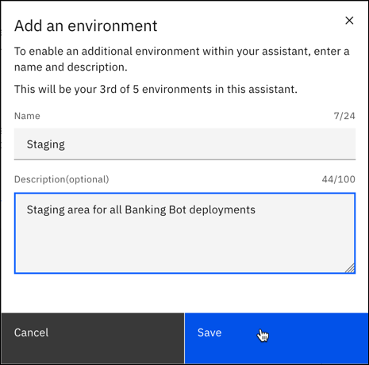
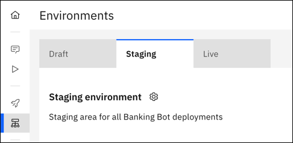
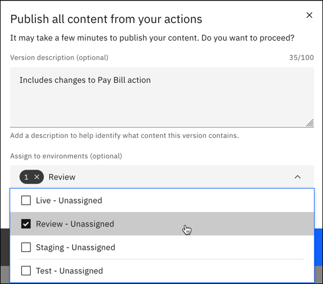
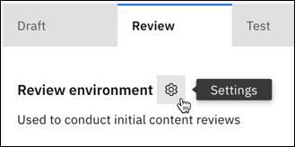

---

copyright:
  years: 2021, 2022
lastupdated: "2022-08-03"

subcollection: watson-assistant

---

{:shortdesc: .shortdesc}
{:new_window: target="_blank"}
{:external: target="_blank" .external}
{:deprecated: .deprecated}
{:important: .important}
{:note: .note}
{:tip: .tip}
{:pre: .pre}
{:codeblock: .codeblock}
{:screen: .screen}
{:javascript: .ph data-hd-programlang='javascript'}
{:java: .ph data-hd-programlang='java'}
{:python: .ph data-hd-programlang='python'}
{:swift: .ph data-hd-programlang='swift'}

{{site.data.content.classiclink}}

# Multiple environments 
{: #multiple-environments}

Each assistant has a draft and live environment. You can add up to three environments as a staging area to test your assistant before deployment. This lets you build content in the draft environment 
and test published versions of your content in the extra environments.
{: shortdesc}

For more information about enviroments, see [Environments](/docs/watson-assistant?topic=watson-assistant-publish-overview#environments).

## Adding environments
{: #multiple-environments-add}

Each new environment appears as an extra tab on your **Environments** page. You can't reorder these environments, so add them to match your test-to-deploy lifecycle.

To add an environment:

1. Open the **Environments** page and click **Add Environment**.

   

1. Enter a name and a description, then click **Save**. Names can't contain spaces or use any special characters.

   

The new environment appears as an additional tab on your **Environments** page.

## Using your environments
{: #multiple-environments-using}

You can use additional environments in your development and test process, before deploying an assistant for customer use.

Add extra environments to match your existing test-to-deploy process. For example, you could name and use five environments in a scenario like this:

| Environment | Used for |
| --- | --- |
| Draft | Conversation authors build actions and test as they work |
| Review | Conduct an initial content review with stakeholders |
| Test | Test assistant content on an configured channel |
| Staging | Use a staging website to test assistant content and channel configurations |
| Live | Deploy for customer use |
{: caption="Example" caption-side="top"}

### Access control to environments
{: #multiple-environments-access}

You can control who can work in each environment. The settings for each environment has an environment ID that you can use in IBM Cloud Identity and Access Management (IAM) and set access by resource. For more information on access control, see [Managing access with Identity and Access Management](/docs/watson-assistant?topic=watson-assistant-access-control#access-control-iam). For more information on settings, see [Environment settings](#environment-settings).

## Publishing content to an environment
{: #multiple-environments-publish}

When publishing content, you have the option to assign it to one or more environments. For more information on publishing, see [Publishing your content](/docs/watson-assistant?topic=watson-assistant-publish).

1. If changes are available to publish, click **Publish**. 

1. Enter a description of the version.

1. Decide whether you want to assign the version to one or more environments. This step is optional if you want to create a snapshot version of your content without using it in an environment right away.

   

1. Click **Publish**.

## Assigning or switching versions in an environment
{: #multiple-environments-assign}

There are two ways to assign a verison to an environment:

- When you a publish a version, you have the option of assigning it to an environment.
- If you want to assign a version later, open the environment tab. In Resolution Methods, click **Assign version** to assign content.

After a version has been assigned to an environment, there are two ways you can switch to a different version:

- When you a publish a version, you have the option of assigning it to an environment, replacing the one that's already there.
- Open the environment tab. In Resolution Methods, click **Switch version** in change content.

### Moving a version through multiple environments
{: #multiple-environments-move}

Here's an example of moving a content version through multiple environments to build, test, iterate, and deploy. 

Using the same example environments as above, you could:

| Environment | Activity |
| --- | --- |
| Draft | Create a version V3 of content |
| Review | Assign version V3 for initial testing |
| Test | Assign version V3 for further testing with a configured channel |
| Staging | Assign version V3 for testing with an internal staging website |
| Live | Deploy version V3 for customer use |
| Live | Assign version V2 after a bug is found in version V3 |
| Draft | Revert to version V3 to fix the bug. For more information, see [Reverting to a previous version](/docs/watson-assistant?topic=watson-assistant-publish#publish-revert) |
| Review | Assign version V4 for retesting |
| Test | Assign version V4 for further retesting |
| Staging | Assign version V4 for testing with an internal staging website |
| Live | Deploy version V4 for customer use and bug fixed |
{: caption="Example" caption-side="top"}

## Previewing an environment
{: #multiple-environments-preview}

On each environment tab, you can click **Preview this environment** to open another browser tab and preview your assistant as an interactive web chat widget. 

You can share this unauthenticated version of your assistant with your team by sending them the link to the environment preview. This lets you share your in-progress assistant with subject-matter experts in your organization without needing access to {{site.data.keyword.conversationshort}} itself.

## Environment settings
{: #multiple-environments-settings}

Each environment has its own settings. On an environment tab, click the **Settings** gear icon to open the settings:

This gives you access to see API details, configure webhook settings, change inactivity timeout, and edit environment details.

**API details** provide these values for each environment:
- Assistant ID
- Environment name
- Environment ID
- Environment URL
- Credentials name
- API key

**Webhooks**

Settings for pre-message, post-message, and log webhooks (Enterprise plan only). For more information, see [Extending your assistant with webhooks](/docs/watson-assistant?topic=watson-assistant-webhook-overview).

**Inactivity timeout**

Specify the amount of time to wait after the user stops interacting with the assistant.

**Edit environment**

Change the name or description of the environment. Names can't contain spaces or use any special characters.

**Delete environment**

If necessary, you can remove the environment. Any channel or extension configurations are removed. Deleting an environment doesn't delete any published content versions. They remain in your list of published versions.
