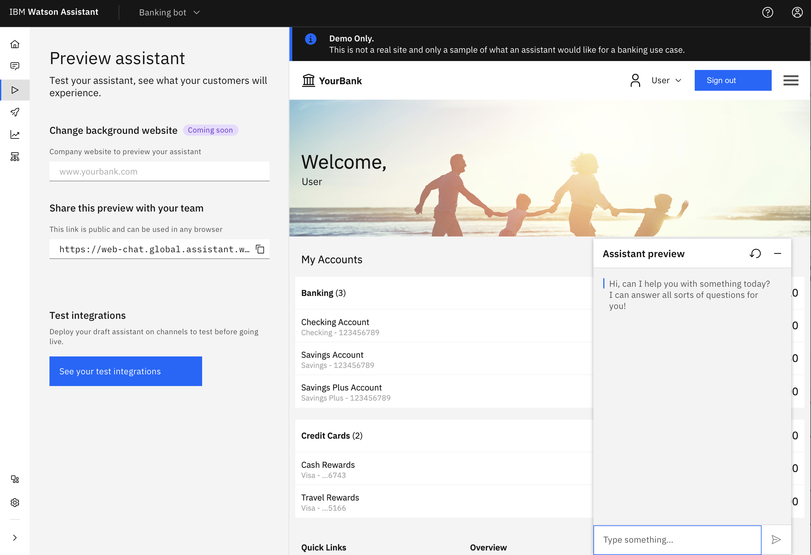
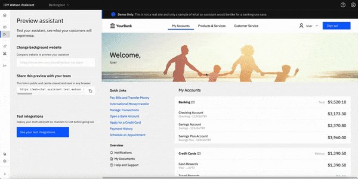

---

copyright:
  years: 2021
lastupdated: "2021-09-02"

subcollection: watson-assistant

---

{:shortdesc: .shortdesc}
{:new_window: target="_blank"}
{:external: target="_blank" .external}
{:deprecated: .deprecated}
{:important: .important}
{:note: .note}
{:tip: .tip}
{:pre: .pre}
{:codeblock: .codeblock}
{:screen: .screen}
{:javascript: .ph data-hd-programlang='javascript'}
{:java: .ph data-hd-programlang='java'}
{:python: .ph data-hd-programlang='python'}
{:swift: .ph data-hd-programlang='swift'}

{{site.data.content.classiclink}}

# Previewing and sharing your assistant
{: #preview-share}

Internal review is a necessary step in any virtual assistant workflow. You need an environment that is free from customer interactions so your team can test your assistant. This draft environment should closely resemble the final experience that your users encounter so you can ensure that you are publishing the optimal end product.

## The **Preview** page

Click **Preview** in the navigation pane to open the Preview page, which you can use to test your assistant with your team. From this page, you can experience your assistant from your customer's perspective.

The following image shows what the built-in web chat integration with Watson Assistant looks like on an example banking website. The interactive web chat widget is labeled **Assistant preview**. The content contained in that assistant is the content that you built into your actions or set up with the search integration.

On the **Preview** page, you also find the following elements:

| Page element | Description |
| --- | --- |
| Share link | You can share an unauthenticated version of your assistant with your colleagues by sending them a link. |
| **Test integrations** panel | Manage the different integrations that you connected to your draft. |
<!-- | Website background input | This feature will be available in a future release. With this feature, you can change the background of the page so you can see what your assistant looks like in different website contexts. | -->

## Saving and editing your work in the draft environment

The **Preview** page represents the draft environment for your assistant. You can think of an _environment_ as a space within the product that contains a version of your work. As you edit and save your work, the version updates to reflect the most up-to-date content.

The draft environment on the **Preview** page cannot be seen by your customers. However, after you deploy your assistant to a channel with customer traffic and publish your assistant, that assistant is in the live environment. To learn more about Watson Assistant environments, see [Environments](/docs/watson-assistant?topic=watson-assistant-publish-overview#environments).

As you edit your assistant from the **Build** page, your changes are automatically reflected on the **Preview** page. This includes any saved changes that are made to your assistant’s extensions, including search or integrations.

You can edit the web chat integration branding, home screen, and settings in the **Test integrations** panel under the web chat channel. Open the integration and select **Draft** to view the configuration pages.

## Previewing more than one channel
Test integrations provide the ability to test channels before you go live with them. You can add more channels to the assistant by going to the **Integrations** catalog in the left navigation.

After you add channels to the assistant, they are accessible from the **Test integrations** panel on the **Preview** page. These channels can be configured and deployed to test different mediums, such as websites and Slack channels, to ensure that your content appears in the way that you want it to.

Do not use these channels for live deployments because they reflect the most recently edited content, not your published content.
