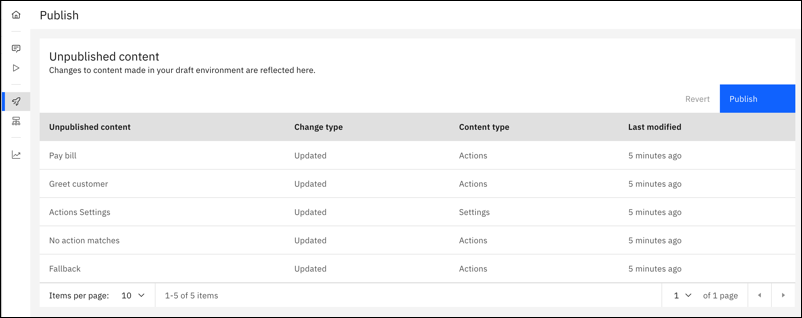
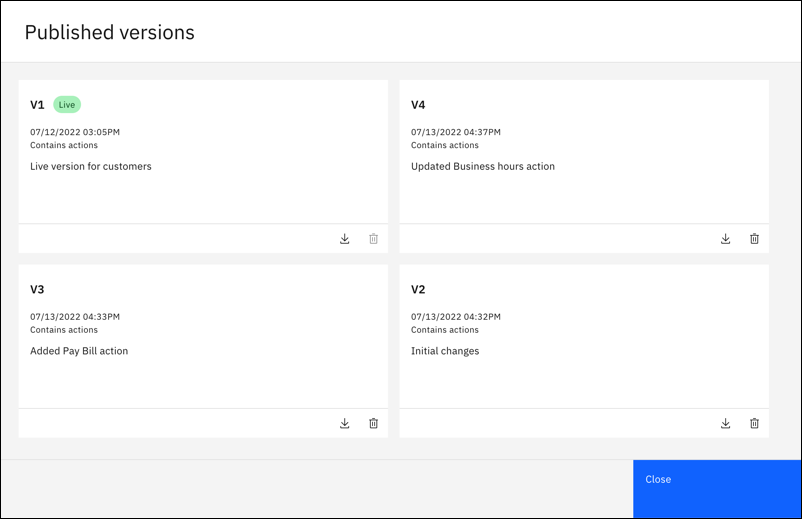

---

copyright:
  years: 2021, 2022
lastupdated: "2022-09-12"

subcollection: watson-assistant

---

{:shortdesc: .shortdesc}
{:new_window: target="_blank"}
{:external: target="_blank" .external}
{:deprecated: .deprecated}
{:important: .important}
{:note: .note}
{:tip: .tip}
{:pre: .pre}
{:codeblock: .codeblock}
{:screen: .screen}
{:javascript: .ph data-hd-programlang='javascript'}
{:java: .ph data-hd-programlang='java'}
{:python: .ph data-hd-programlang='python'}
{:swift: .ph data-hd-programlang='swift'}

{{site.data.content.classiclink}}

# Overview
{: #publish-overview}

After you have built an assistant, you can test to make sure it works as you intended before you make it available to customers. {{site.data.keyword.conversationshort}} makes it straightforward to preview your assistant in a closed environment and manage exactly what you make available to customers.
{: shortdesc}

An assistant consists of three core elements:

- **Content**: The conversation logic and words that are used to respond to your customer. Content is required for every assistant.
- **Channels**: The location where your assistant interacts with your customers, such as the web chat interface on your website. At least one channel is required for every assistant.
- **Extensions**: Add-ons to the end experience that help solve specific customer problems (for example, searching existing help content).

In general, you follow this high-level process throughout the life of your assistant:

1. Build your initial content.
1. Test your content in the draft environment, and gain approval from team members.
1. Publish different versions of your draft content.
1. Set up the channels in your live environment where customers will interact with your assistant.
1. Assign your published version to the live environment for customers to use.
1. Use analytics to improve your assistant and republish content as needed.

## Environments
{: #environments}

You can group your work in separate containers that are called _environments_. Each environment contains its own content, channels, and extensions. Environments also have their own IDs, URLs, and service credentials that can be referenced by external services.

Each new assistant comes with two environments: the draft environment and the live environment. On the **Environments** page, the draft environment can be managed from the **Draft environment** tab, and the live environment can be managed from the **Live environment** tab. Your customers interact with assistants on the live environment and cannot interact with assistants on the draft environment. The separation of these two environments allows you to build and iterate on your content separately from what your customers see. You do not want customers to stumble upon an incomplete action that leads them to a dead end.

## The draft environment
{: #publish-overview-draft}

The draft environment contains all your in-progress work in the **Actions**, **Preview**, and **Publish** pages. Use the **Draft environment** tab to manage the draft environment, including adding draft environment integrations (channels and extensions) that you can use for internal testing before going live. These integrations are unique to the draft environment, and changes to draft integrations don't affect the live environment.

You can click **Preview this environment** to open another browser tab and see the draft environment as a sample web chat.

For more information about previewing your assistant in the draft environment, see [Previewing and sharing your assistant](/docs/watson-assistant?topic=watson-assistant-preview-share).

## Publishing
{: #publish-overview-publishing}

When you are ready to create a snapshot of your content and settings, you can publish from the **Publish** page. Each time you publish, you create a new version, such as V1 or V2. When you publish a version, you can choose to assign it to the live environment.

When you publish your content, {{site.data.keyword.conversationshort}} creates a snapshot of the draft content, resulting in a version. This version contains all of the content from actions, including settings and variables. Versions do not contain integration configurations or environment settings. Integration configurations and environment settings must be configured manually in each environment.

The three most recent published versions appear in a list on the **Publish** page itself. If you have more than three versions, you can click **View all** to see a list of all published versions.

The number of versions that can be maintained depends on the type of plan you have. If you reach the plan limit of versions you can have, you need to delete a version before you can publish another one. For information about {{site.data.keyword.conversationshort}} plan limits, see [Pricing plans](https://www.ibm.com/cloud/watson-assistant/pricing/){: external}.
{: important}

## The live environment
{: #publish-overview-live}

Use the **Live environment** tab to manage the live environment. This tab indicates which content is live in the assistant and which channels that content is connected to. The left side of the tab displays the channels where content is deployed, or where customers can interact with the assistant. The right side of the tab displays the resolution methods, or how the assistant responds to customer questions or requests.

The version of content displayed under **Published content** is the version that is connected to the live environment. 

There are two ways to assign a verison to the live environment:

- When you a publish a version, you have the option of assigning it to the live environment.
- If you want to assign a version later, use the **Live environment** tab and click **Assign version**.

After a version has been assigned to the live environment, there are two ways you can switch to a different version:

- When you a publish a version, you have the option of assigning it to the live environment, replacing the one that's already there.
- Use the **Live environment** tab and click **Switch version**.

For more information about publishing, see [Publishing your content](/docs/watson-assistant?topic=watson-assistant-publish).

## Environment settings
{: #publish-overview-environment-settings}

The draft and live environments each have settings. On either tab, click the **Settings** gear icon to open the settings. This gives you access to API details, webhook settings, and inactivity timeout.

**API details** provide these values for each environment:
- Assistant ID
- Environment name
- Environment ID
- Environment URL
- Credentials name
- API key

**Webhooks**

Settings for pre-message, post-message, and log webhooks. For more information, see [Extending your assistant with webhooks](/docs/watson-assistant?topic=watson-assistant-webhook-overview).

**Inactivity timeout**

Specify the amount of time to wait after the user stops interacting with the assistant.
